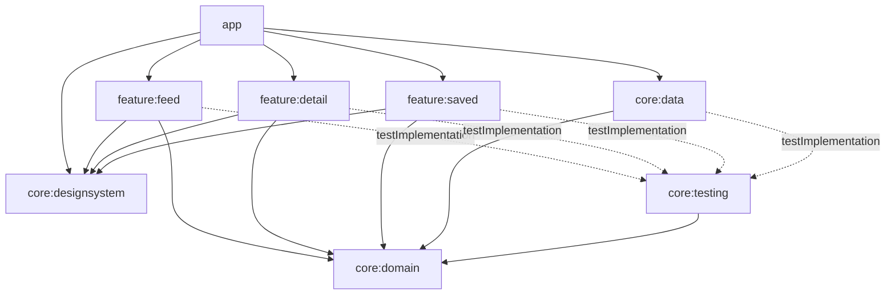

# LineFeed：架構與實作計畫

> 讀者：負責實作的 agent（Sonnet），以及寫 README / DECISIONS.md 時的作者本人。
> 原則：**每一步都能獨立 build、都有測試、都講得出理由**。遇到本文件沒寫清楚的地方，選最簡單、可測試的做法，並記在 commit message 或 `docs/NOTES.md`（實作期間的決策流水帳，最後彙整進 DECISIONS.md）。
>
> 本文件中的版本、API 欄位、payload 大小都在 2026-09-21 於本機實際驗證過（見 §6、§8 的「驗證證據」）。
>
> **修訂紀錄**
> - v1（2026-09-21）：初版，分頁採手寫 keyset。
> - v2（2026-09-21）：Wayne 審閱後推翻 §2.8，分頁改為 **Paging 3 + RemoteMediator**（保留 keyset 游標於 APPEND）。受影響：§0、§1.3、§2.2、§2.8、§3.3、§3.5、§4.1、§5.2、§5.5、§6.4、§6.5、§7.1、§7.2、§7.4、§7.5、§8、§9、§10（Step 6 起）、§11。Step 1–5 不變；需要調整的 interface/entity 併入 Step 6。

---

## 0. 一頁摘要

| 項目 | 決定 |
|---|---|
| UI | Jetpack Compose + Material 3，自訂品牌綠色主題，支援 Dark theme（不用 dynamic color） |
| 架構 | 單向資料流（UDF）；Room 是唯一資料來源（single source of truth）；ViewModel 對外暴露 `StateFlow<XxxUiState>`（非分頁狀態），Feed 另外暴露 `Flow<PagingData<FeedItem>>` |
| DI | Hilt（KSP） |
| 持久化 | Room（文章快取、收藏快照、天氣、服務卡、同步 metadata 全部進同一個 DB）；**不使用 DataStore** |
| 網路 | Retrofit 3 + OkHttp 5 + kotlinx.serialization；OkHttp 磁碟快取（尊重 server `Cache-Control`） |
| 圖片 | Coil 3（共用 OkHttpClient）；收藏文章的圖片另外下載到 `filesDir`，保證離線可看 |
| 並行 | Coroutines + Flow；注入 `CoroutineDispatcher`、`@ApplicationScope CoroutineScope`、`AppClock` |
| 分頁 | **Paging 3 + `RemoteMediator` + Room `PagingSource`**（v2 修訂，見 §2.8）。APPEND 保留 keyset 游標（`published_at_lte` + id 去重，游標存 `remote_keys` 表）；文章帶遞增 `sortIndex`，服務卡以 `insertSeparators` 依 `sortIndex` 規則穿插；天氣 hero 不進 PagingData（LazyColumn 先放 `item {}`） |
| 新鮮度 | 每個來源各自 TTL（天氣 15/30 分、文章 20/60 分、服務卡 12/24 小時，依 unmetered/metered），stale-while-revalidate，只在前景刷新，無背景同步。文章的冷啟動決策在 `RemoteMediator.initialize()`，與其他來源共用同一個 `FreshnessPolicy` |
| Module | 8 個 module + `build-logic` convention plugins：`app`、`core:domain`(純 JVM)、`core:data`、`core:designsystem`、`core:testing`(純 JVM)、`feature:feed`、`feature:detail`、`feature:saved` |
| 工具鏈 | Gradle 9.7.1、AGP 9.4.0（內建 Kotlin）、Kotlin 2.4.20、KSP 2.3.12、compileSdk 37 / targetSdk 36 / minSdk 24、JDK 21 執行、bytecode target 17 |
| 測試 | JUnit4 + kotlinx-coroutines-test + Turbine + 手寫 Fake；Room/Repository/RemoteMediator 測試用 Robolectric（SDK 36）+ in-memory Room；分頁用官方 `paging-testing`（`TestPager`、`asSnapshot()`）；網路解析用 MockWebServer + 真實 JSON fixture。**不用 MockK** |
| 指令 | Build：`./gradlew assembleDebug`；測試：`./gradlew unitTest`（root 聚合 task） |

---

## 1. 需求拆解與優先序

### 1.1 Must-have（全部要做）

| # | 需求 | 本專案對應 | 理由 / 備註 |
|---|---|---|---|
| M1 | Feed 分頁載入 | Spaceflight News 文章，Paging 3 + RemoteMediator（APPEND 用 keyset 游標），接近底部自動載入下一頁 | 需求明文 |
| M2 | 詳情頁 | `feature:detail`：大圖、來源、時間、作者、標題、summary、「閱讀原文」 | Spaceflight API 只提供 summary，沒有全文（見 §4.4） |
| M3 | 收藏 / 取消收藏，首次載入後離線可讀 | `bookmarks` 表存完整快照 + 圖片存到 `filesDir` | 不能只存 id（feed 快取會被清） |
| M4 | 「已收藏」清單頁 | `feature:saved` | 需求明文 |
| M5 | 異質 feed（至少再一種真實來源、不同 cell） | Open-Meteo 天氣 hero 卡（置頂）+ DummyJSON 服務卡（穿插） | 兩種都免 key；做兩種來源而非一種，因為「兩種更新節奏不同的來源」才能展示新鮮度策略的差異（分鐘 vs 小時 vs 天） |
| M6 | 新鮮度策略 | `FreshnessPolicy` + `DefaultFeedRefresher`，README 說明推理 | 評分重點之一 |
| M7 | 所有 UI 狀態：loading / empty / error / offline | 每個畫面都有明確狀態表（§5） | 需求明文 |
| M8 | minSdk 24、Kotlin、一行指令 build、真實 commit history | §8、§10 | 基本規則 |
| M9 | README / DECISIONS.md / AI_USAGE.md / Plan & Sequencing / 已知限制 | 最後一個 commit | 繳交物 |

### 1.2 Nice-to-have（要做，依序）

| 優先 | 項目 | 理由 |
|---|---|---|
| N1 | **測試涵蓋快取 / 新鮮度 + 非同步邏輯** | 投報率最高：直接證明 M6 的推理是「被驗證過的」，且面試時可以拿測試當講稿 |
| N2 | **多 module** | 依賴方向由 build 強制（feature 碰不到 Room/Retrofit），且是 Senior 職缺常問話題 |
| N3 | **CI（GitHub Actions）** | 很便宜（一個 yml），而且越早加越有價值：之後每個 commit 都被驗證 → 放在第 2 個實作 commit |
| N4 | **Dark theme** | Material 3 幾乎零成本，只需要定義兩組 color scheme |
| N5 | 第二種異質來源（天氣 + 服務卡兩種都做） | 已併入 M5 |
| N6 | 本地搜尋 / 過濾（Saved 頁） | 選「離線可用、零流量」的版本，與新鮮度 / 省流量主題一致；排在最後，時間不夠第一個砍 |
| N7 | 輕量動畫：`Modifier.animateItem()`、Coil crossfade、收藏 icon 切換動畫 | 幾行程式碼；複雜轉場（shared element）不做 |

### 1.3 刻意延後 / 砍掉（README Plan & Sequencing ③ 的素材）

| 項目 | 決定 | 理由 |
|---|---|---|
| 電影卡（TMDB） | 砍 | 需要 API key → 面試官 clone 下來不能直接跑，違反「一行指令 build 起來就能用」的精神 |
| 背景定期同步（WorkManager） | 砍 | 使用者沒在看的時候刷新 = 浪費流量與電量；前景 SWR 已足夠讓 feed「打開就新鮮」。若要做：`PeriodicWorkRequest` + `NetworkType.UNMETERED` + `requiresCharging`，預抓第一頁 |
| 離線閱讀「原文全文」 | 砍 | API 只給 summary；抓第三方網頁做 readability 萃取 / WebView archive 屬於另一個產品題目，且有版權與流量問題。離線可讀範圍 = API 提供的全部欄位 + 圖片 |
| 依定位的天氣 | 砍（固定台北） | 需要定位權限與權限拒絕流程，對評分重點（新鮮度、離線）沒有幫助 |
| 遠端搜尋（API `search=`） | 延後 | 選擇本地過濾（離線可用）；遠端搜尋需要另一套分頁與 debounce 取消邏輯 |
| 手寫分頁 | 不採用（v2 修訂：改用 Paging 3） | 見 §2.8「決策變更紀錄」 |
| 文章刷新「重疊合併」（保留舊頁） | 延後（v2） | 採 Paging 3 標準做法：REFRESH 成功後在 transaction 內清空重建，`sortIndex` 從 0 重排，保持 separator 規則簡單；代價是舊頁需重新 APPEND（JSON 每頁約 5 KB，圖片多半命中 Coil 磁碟快取） |
| 拆分 `core:network` / `core:database` | 延後 | 目前只有 `core:data` 一個消費者；等第二個消費者出現再拆（YAGNI） |
| 「N 則新文章」提示 pill | 延後 | 回前景的文章刷新只在 Feed 畫面可見時才執行（§3.3），且刷新後捲回頂端；pill 是更好的 UX 但非必要 |
| Compose UI 測試 / 截圖測試 / instrumented test | 延後 | UI 狀態由 ViewModel 單元測試覆蓋（狀態 → 畫面是純渲染）；UI 測試回報率較低 |
| 漢堡選單 / Drawer | 砍 | 參考圖有，但沒有實際內容可放；放一個空選單比沒有更糟 |
| 取消收藏的 Undo snackbar | 延後 | 好的 UX，但非必要 |
| Baseline Profile、R8 release 設定、zh-TW 在地化 | 延後 | 作業範圍外；字串全部放 `strings.xml`，之後加 `values-zh-rTW` 即可 |
| 使用者可調的 Data Saver 設定頁 | 延後 | `TtlConfig` 已抽象化，之後加設定只是換一組 TTL |

---

## 2. 架構決策（DECISIONS.md 素材）

每一項格式：**選擇 → 替代方案 → 取捨**。

### 2.1 UI：Jetpack Compose + Material 3
- **選擇**：Compose、Material 3（`PullToRefreshBox`、`NavigationBar`、`Card`）、`LazyColumn` 搭配 `key` + `contentType`。
- **替代**：Views + RecyclerView（`ListAdapter` + 多 ViewType）。
- **取捨**：異質 cell 在 Compose 裡就是 `when (item)`，不用寫 ViewHolder / DiffUtil；狀態驅動 UI 與 UDF 天然契合；Dark theme 零成本。代價是 Compose 效能陷阱（不穩定參數造成重組）——Kotlin 2.x 預設 strong skipping，且 `LazyColumn` 使用穩定 key，足以應付此規模。Views 在大型既有專案（LINE 主 App）仍常見，面試時可說明「新專案選 Compose，既有 Views 專案會用 `ComposeView` 漸進導入」。

### 2.2 狀態管理：UDF + 單一 `StateFlow<UiState>`
- **選擇**：
  - 每個 ViewModel 對外只有 `val uiState: StateFlow<XxxUiState>` 與若干 `fun onXxx()` 事件方法。
  - `uiState` = `combine(repository flows…, 本地 MutableStateFlow)` → `stateIn(viewModelScope, SharingStarted.WhileSubscribed(5_000), initial)`。
  - 一次性訊息（snackbar）**放在 state 裡**（`userMessage: UserMessage?` + `onUserMessageShown()`），不用 `Channel`/`SharedFlow`——config change / 背景時不會遺失，也容易測試（Google 官方 UI layer 指引的做法）。
  - 「是否整頁顯示 loading/empty/error/offline」由**純函式** `deriveFullScreenState(...)` 推導，單獨測試。
  - **分頁內容例外（v2）**：Feed 的文章 + 服務卡是 `val feedItems: Flow<PagingData<FeedItem>>`（`cachedIn(viewModelScope)`），不放進 UiState——`PagingData` 不是可比較的值，塞進 data class 會破壞 state 的語意。分頁的 loading/error 來自 `LazyPagingItems.loadState`（UI 端），整頁狀態由純函式 `deriveFeedScreenState(loadStates, itemCount, isOffline)` 在 UI 端推導並單獨測試。天氣、離線、刷新請求、snackbar 仍在 `StateFlow<FeedUiState>`。
  - 取捨：Feed 畫面有兩個狀態來源（UiState + LoadState），比單一 state 多一點心智負擔；換來 Paging 內建的 append 觸發、retry、LoadState。
- **替代**：MVI 框架（Orbit / Mavericks）、多個獨立 `StateFlow`、`LiveData`、Compose `mutableStateOf` 放在 VM。
- **取捨**：單一 state 物件讓「不可能狀態」較難出現、測試只需斷言一個值；代價是每次任何欄位變動都複製整個 data class（此規模可忽略）。不引入 MVI 框架以避免額外概念與依賴。

### 2.3 DI：Hilt
- **選擇**：Hilt + KSP；`@HiltViewModel`；`@Binds` 綁定 domain interface → data 實作；qualifier：`@IoDispatcher`、`@ApplicationScope`、`@SpaceflightRetrofit` / `@OpenMeteoRetrofit` / `@DummyJsonRetrofit`。
- **替代**：Koin（runtime 解析，錯誤在執行期才爆）、手動 DI（`AppContainer`，ViewModel factory 樣板多）、kotlin-inject / Metro（新但生態較小）。
- **取捨**：編譯期驗證圖、Android 標準、與 Navigation/ViewModel 整合；代價是 KSP 編譯時間與註解樣板。**單元測試不使用 Hilt**：所有 class 都是 constructor injection，測試直接 `new` 並傳入 fake，因此不需要 `hilt-android-testing`。

### 2.4 持久化：Room（唯一 DB），不用 DataStore
- **選擇**：Room 2.8.5，一個 `LineFeedDatabase`，5 張表（§6.4）。
- **替代**：DataStore（存 timestamp）、SQLDelight、檔案 JSON 快取、只靠 OkHttp HTTP cache。
- **取捨**：
  - 「資料寫入」與「lastSuccessAt 更新」必須**在同一個 transaction**，否則會出現「時間戳說新鮮但資料是舊的」；若 metadata 放 DataStore 就做不到原子性 → 這是 metadata 也進 Room 的關鍵理由。
  - Room 的 `Flow` 查詢讓 UI 自動反映快取變化（SSOT）。
  - 只靠 HTTP cache 無法做「過期資料仍顯示」與收藏離線保證。
  - Schema 匯出到 `core/data/schemas/`（commit 進 repo）。**不使用 `fallbackToDestructiveMigration`**：收藏是使用者資料，升版必須寫 migration（目前 version 1）。

### 2.5 網路：Retrofit 3 + OkHttp 5 + kotlinx.serialization
- **選擇**：三個 base URL → 三個 Retrofit instance（qualifier），共用一個 `OkHttpClient`（10 MB 磁碟 `Cache`、timeout、debug 才加 `HttpLoggingInterceptor`）。JSON：`Json { ignoreUnknownKeys = true; explicitNulls = false; coerceInputValues = true }`，converter 用官方 `converter-kotlinx-serialization`。
- **替代**：Ktor client（KMP 友善但設定多）、Moshi（需 KSP codegen 或 reflection）、Gson（不理解 Kotlin null-safety）。
- **取捨**：Retrofit 在 Android 業界最普遍；kotlinx.serialization 無反射、Kotlin-first、編譯期產生 serializer，也被 Navigation type-safe route 使用（同一套工具）。Retrofit service 被包在 `XxxRemoteDataSource` interface 後面，repository 測試用 fake remote，不必起 server；Retrofit 介面本身另用 MockWebServer 測 URL/參數/解析。

### 2.6 圖片載入：Coil 3
- **選擇**：`coil-compose` + `coil-network-okhttp`（共用 OkHttpClient），Application 實作 `SingletonImageLoader.Factory`：記憶體快取 25%、磁碟快取 100 MB、crossfade。
- **替代**：Glide（成熟，但 Compose 整合是次要）、Fresco。
- **取捨**：Coil 是 Kotlin/coroutines/Compose-first，API 小。**但 Coil 磁碟快取是 LRU、可被清除**，不能作為收藏離線的保證 → 收藏圖片另存 `filesDir`（§4.2）。

### 2.7 並行模型：Coroutines + Flow
- **選擇**：
  - Repository 對外：`Flow<T>`（觀察快取）+ `suspend fun`（一次性動作）。
  - 注入 `@IoDispatcher CoroutineDispatcher`（只用在檔案 IO，例如收藏圖片寫檔；Room/Retrofit 的 suspend API 已是 main-safe，不需包 `withContext`，這點要在 DECISIONS 講清楚，避免「到處 withContext(IO)」的反模式）。
  - `@ApplicationScope CoroutineScope`（`SupervisorJob() + Dispatchers.Default`）：給不該隨畫面取消的工作——前景刷新、收藏圖片下載、single-flight 共享工作。
  - `AppClock` interface 注入現在時間；`NetworkMonitor` interface 注入網路狀態。
  - **Single-flight**：同一來源同時被觸發多次刷新（例如回前景 + 網路恢復同時發生）時，只打一次網路，其餘呼叫者 await 同一個結果（`SingleFlight<K, V>` 小工具，§7）。
  - 自訂 `suspendRunCatching {}`：捕捉例外但**重新拋出 `CancellationException`**（`runCatching` 會吞掉取消，是常見 bug）。
- **替代**：RxJava（學習成本、與 Compose/Room 整合不如 Flow）、callback。
- **取捨**：Flow 是 Room/Compose/Lifecycle 的原生語言；結構化並行讓取消正確傳遞。

### 2.8 分頁：Paging 3 + RemoteMediator + Room PagingSource（v2 修訂）
- **選擇**：
  - `Pager(PagingConfig(pageSize = 20, prefetchDistance = 5, initialLoadSize = 20, enablePlaceholders = false), remoteMediator = ArticleRemoteMediator(...)) { feedArticleDao.pagingSource() }`，Pager 在 `core:data` 建立，domain interface 暴露 `Flow<PagingData<Article>>`（`paging-common` 是 KMP/JVM artifact，`core:domain` 仍維持純 JVM）。
  - **Room 是唯一資料來源**：UI 只讀 Room `PagingSource`；`ArticleRemoteMediator` 是**唯一會寫入文章快取的程式碼**。
  - `PagingSource` 查詢：`feed_articles LEFT JOIN bookmarks` 一次帶出 `isBookmarked`，`ORDER BY sortIndex ASC`。收藏變動時 Room 自動 invalidate，不需要在 VM 另外 combine 收藏 id。
  - **REFRESH**：抓第一頁（`?limit=20&ordering=-published_at`）→ 成功後才開 transaction：`clearAll()` + 清 remote key + 以 `sortIndex = 0..n-1` 寫入 + 寫 `remote_keys(nextCursor = 本頁最舊 publishedAt, endReached)` + `sync_metadata.markSuccess(ARTICLES)`。失敗則快取不動，回 `MediatorResult.Error`。
  - **APPEND（保留 keyset 游標的優點）**：游標取自 `remote_keys.nextCursor`（不是 offset、也不用 `next` URL），呼叫 `?published_at_lte=<cursor>&ordering=-published_at&limit=20`；先查 `existingIds()` 濾掉邊界重複，只為**新 id** 指派 `sortIndex = maxSortIndex + 1 …`（在 transaction 內計算）；結束條件：回傳筆數 < pageSize 或「沒有任何新 id」（同秒大量文章的無限迴圈保護）。`remote_keys` 不存在（從未成功 REFRESH）時回 `Success(endOfPaginationReached = false)`，等 REFRESH 寫入後 PagingSource invalidate 再觸發。離線時直接回 `MediatorResult.Error(OfflineException)`，不發無謂請求。
  - **PREPEND**：永遠 `Success(endOfPaginationReached = true)`（新文章由 REFRESH 取得）。
  - **`initialize()`** 用同一個 `FreshnessPolicy`：`evaluate(ARTICLES, lastSuccessAt, network, COLD_START)` 為 `Fetch` → `LAUNCH_INITIAL_REFRESH`，否則 `SKIP_INITIAL_REFRESH`（§3.3）。
  - **異質混排**：
    - 天氣 hero **不進 PagingData**：`LazyColumn { item(key = "weather") { WeatherHeroCard } ; items(lazyPagingItems.itemCount, key = lazyPagingItems.itemKey { it.key }, contentType = lazyPagingItems.itemContentType { it.contentType }) { … } }`。
    - 服務卡：VM 以 `pagingData.map { it.toFeedItem() }.insertSeparators { before, after -> … }` 插入，判斷規則抽成純函式 `ServiceCardSlots.slotBefore(sortIndex: Long): Int?`（`sortIndex >= firstAfter && (sortIndex - firstAfter) % every == 0` → `slot = (sortIndex - firstAfter) / every`，預設 `firstAfter = 3, every = 6`），卡片取 `services[slot % services.size]`，key `service-$slot`（slot 由唯一的 sortIndex 決定 → 必唯一）。
    - `sortIndex == 0` 的文章 map 成 `FeedItem.TopStory`，其餘 `FeedItem.ArticleRow`。
- **為什麼 APPEND 仍用 keyset 而非 offset**：文章持續新增，offset 分頁在「讀第 2 頁之前有新文章發布」時會重複或漏掉；已驗證 API 支援 `published_at_lte` / `published_at_lt`（§6.1）。游標存在 `remote_keys` 而非從 `PagingState.lastItemOrNull()` 推：程序重啟後（`SKIP_INITIAL_REFRESH`）仍知道游標與是否到底。
- **替代方案（原 v1 決策）**：手寫 keyset 分頁——Room `Flow<List<Article>>` 觀察整個快取、VM 持有 `AppendState` 狀態機、`snapshotFlow` 偵測接近底部觸發 `loadNextPage()`、純函式 `FeedAssembler` 組合天氣/文章/服務卡。
- **取捨**：
  - Paging 3 得到：內建 append 觸發與 prefetch、`LoadState`（loading/error/end）、`retry()`/`refresh()`、記憶體視窗化、與 Room invalidation 的整合、官方測試工具（`paging-testing`）。
  - 代價：Feed 畫面有兩個狀態來源（UiState + LoadState）；`insertSeparators` 需要 DB 維護 `sortIndex`；`RemoteMediator` 的邊界情況（空 DB 時的 APPEND、REFRESH 與 APPEND 的順序）需要理解 Paging 內部行為；REFRESH 清空重建使「重疊合併」不再適用。
- **決策變更紀錄（面試素材）**：v1 計畫（Opus 規劃）選擇手寫分頁，理由是 (1) `insertSeparators` 沒有 index、難以「每 N 篇插一張」，(2) `initialize()`/`REFRESH` 會與集中式新鮮度協調器重複決策，(3) 快取規模小，(4) 手寫較好測。Wayne 審閱後推翻，逐點回應：(1) 天氣 hero 不必進 PagingData；服務卡位置可由 mediator 寫入時指派遞增 `sortIndex` 解決，規則抽成純函式即可測；(2) 讓 `initialize()` 直接呼叫同一個 `FreshnessPolicy`，政策仍是唯一決策點，只是多一個呼叫端；(3) Paging 的價值是內建 LoadState/retry/append 觸發（省工），不是記憶體；(4) 官方 `paging-testing`（`TestPager`、`asSnapshot()`）足以測 PagingSource 與轉換，RemoteMediator 可用 Robolectric + in-memory Room 直接呼叫 `load()` 測。**結論：採用 Paging 3，保留 v1 的 keyset 游標設計於 APPEND。** 這段要寫進 DECISIONS.md 與 AI_USAGE.md（「拒絕/改寫了 AI 的建議」的真實例子）。

### 2.9 Module 結構
- **選擇**（8 module + included build `build-logic`）：



  - `core:domain`：**純 Kotlin/JVM**。domain model、repository interface、`FreshnessPolicy`、`AppClock`、`NetworkMonitor` interface、`AppError`。沒有 Android 依賴 → 由 build 系統保證 domain 邏輯可在 JVM 上快速測試。
  - `core:data`：Android library。網路（Retrofit/DTO）、資料庫（Room）、repository 實作、刷新協調器、`ConnectivityNetworkMonitor`、Hilt module。實作 class 都是 `internal`。
  - `core:designsystem`：theme（light/dark）、共用 composable（狀態畫面、離線 banner、收藏按鈕、網路圖片）、`RelativeTimeFormatter`。
  - `core:testing`：**純 JVM**。所有 fake（repository、clock、network monitor）+ `MainDispatcherRule`，放在 `main` source set 讓各 module 以 `testImplementation` 共用。
  - `feature:*`：只依賴 `core:domain` + `core:designsystem`，**看不到 Room / Retrofit**（`core:data` 不在其 classpath）。
  - `app`：`Application`、`MainActivity`、NavHost、底部導覽、前景刷新觸發。
- **替代**：(a) 單一 `app` module 以 package 分層；(b) Now-in-Android 完整版（`core:network`、`core:database`、`core:datastore`、`core:model`、`core:ui`… 十幾個 module）。
- **取捨**：(a) 最簡單，但依賴方向只靠紀律；(b) 對一週作業過度，build 設定成本高、每個 module 都要樣板。選中間值：切在「真正有價值的邊界」——domain 純 JVM、feature 與資料實作隔離、測試 fake 共用。網路與 DB 暫不拆（只有一個消費者）。以 convention plugins 消除重複設定，每個 module 的 `build.gradle.kts` 只剩幾行。

### 2.10 導覽
- **選擇**：Navigation Compose 2.10.1 type-safe routes（`@Serializable data object FeedRoute`、`@Serializable data class ArticleDetailRoute(val articleId: Long)`）。每個 feature 提供 `NavGraphBuilder.feedScreen(onArticleClick: (Long) -> Unit)` 之類的 extension；只有 `app` 知道所有 route，feature 之間不互相依賴。
- **替代**：Navigation 3（較新、API 仍在演進）、Compose Destinations（第三方）。
- **注意**：ViewModel 讀參數用 `savedStateHandle.get<Long>("articleId")`，**不要用 `savedStateHandle.toRoute<>()`**——後者需要 Android `Bundle`，純 JVM 單元測試會失敗。

### 2.11 主題
- 品牌綠 `#06C755` 為 primary seed，定義 light / dark 兩組 `ColorScheme`；跟隨系統深色模式。
- **刻意不用 dynamic color（Material You）**：內容型 App 的品牌識別比桌布配色重要；這是可討論的取捨。

---

## 3. 新鮮度（Freshness）策略（README 核心章節）

### 3.1 先看數據（2026-09-21 實測）

| 請求 | gzip 後大小 |
|---|---|
| Spaceflight 文章 1 頁（20 筆） | ~4.9 KB |
| Open-Meteo 台北 current + 7 日 | ~0.4 KB |
| DummyJSON 10 筆（**有** `select=`） | ~1.4 KB（沒 `select` 是 3.4 KB） |
| **一次完整刷新三個來源** | **~6.7 KB** |
| 一張 Spaceflight 文章圖 | ~100 KB |

- 文章發布頻率：最近 100 篇跨越約 8 天 → **約每天 12 篇、每小時 0.5 篇**。
- Open-Meteo `current.interval = 900` → 天氣資料**每 15 分鐘**才更新一次。
- Spaceflight 回應帶 `Cache-Control: max-age=600`；DummyJSON 帶 `ETag`、rate limit 100。

**結論（README 要寫的推理）**：JSON 很小，真正吃流量的是**圖片**。因此新鮮度策略的目標是：
1. 不做「不可能拿到新資料」的請求（比來源更新頻率更頻繁地刷新毫無意義）；
2. 刷新不要造成**圖片重新下載**（保留快取、以 id 合併而非整批替換、Coil 磁碟快取）；
3. 使用者沒在看就不刷新（無背景同步）；
4. 使用者明確要求（下拉）時永遠尊重。

### 3.2 定義「新鮮」

> 某來源的快取是「新鮮」的 ⇔ `now - lastSuccessAt < ttl(source, networkType)`。
> 「過期（stale）」的資料**仍然顯示**（stale-while-revalidate），同時在背景刷新；
> 「過舊（outdated）」只影響 UI 標示（例如天氣卡顯示「3 小時前更新」警示色），不影響是否顯示。

| 來源 | TTL（unmetered / Wi-Fi） | TTL（metered / 行動網路） | outdated 標示門檻 | 理由 |
|---|---|---|---|---|
| 天氣（Open-Meteo） | 15 分 | 30 分 | 3 小時 | 資料源本身 15 分更新；天氣是「現在」的資訊，最需要新 |
| 文章（Spaceflight，第一頁） | 20 分 | 60 分 | 12 小時 | 每小時約 0.5 篇；server 自己宣告 max-age 10 分 |
| 服務卡（DummyJSON） | 12 小時 | 24 小時 | — | 推廣內容以「天」為單位變動；另可避免 rate limit |

- Metered 網路 TTL 較長（省流量），unmetered 較短（便宜，換取更新鮮）。
- 下一頁（append）**不受 TTL 管**：使用者往下捲就是明確意圖，只要在線就抓。
- TTL 集中在 `TtlConfig`，之後若加「Data Saver」設定只是換一組值。

### 3.3 何時觸發刷新

| 觸發（`RefreshTrigger`） | 天氣 / 服務卡（`DefaultFeedRefresher`） | 文章（Paging 3） |
|---|---|---|
| `COLD_START`（程序第一次進入前景） | 立即顯示快取；逐來源判斷 TTL，只刷新過期的 | **由 `ArticleRemoteMediator.initialize()` 決定**：policy 說 Fetch → `LAUNCH_INITIAL_REFRESH`，否則 `SKIP_INITIAL_REFRESH`（Pager 建立＝文章的冷啟動）。協調器在 COLD_START 不碰文章，避免雙重決策 |
| `FOREGROUND`（從背景回前景，`ProcessLifecycleOwner` ON_START） | 同上。TTL 本身就是節流器：5 分鐘內切換 App 十次也不會多打請求 | 協調器以 policy 判斷；Fetch 時**不直接抓**，而是發出「文章刷新請求」（`RefreshStatus.articleRefreshRequestId` 遞增）。Feed 畫面可見時以 `LaunchedEffect` 呼叫 `lazyPagingItems.refresh()`（→ mediator REFRESH）並捲回頂端；使用者在 Saved 頁時請求保留到回 Feed 才執行（看不到的畫面不花流量） |
| `NETWORK_RESTORED`（前景中 offline → online） | 同上 | 同 FOREGROUND |
| `USER_PULL`（下拉重新整理 / 錯誤頁的重試） | **忽略 TTL 全部刷新**（不論 metered） | UI 呼叫 `lazyPagingItems.refresh()`；mediator 的 `load(REFRESH)` 永遠抓網路（`initialize()` 只在 Pager 建立時呼叫一次） |
| 背景中的任何事件 | 不刷新 | 不刷新 |

重點：**`FreshnessPolicy` 是唯一的決策規則**，只有兩個呼叫端——`initialize()`（Pager 建立時）與 `DefaultFeedRefresher`（生命週期/網路觸發）；**`ArticleRemoteMediator` 是唯一會寫入文章快取的程式碼**。兩者分工不重疊：COLD_START 的文章歸 `initialize()`，其餘觸發歸協調器（經由 UI 的 `refresh()` 走 mediator）。

觸發流由純 Flow 函式 `refreshTriggers(isForeground: Flow<Boolean>, network: Flow<NetworkStatus>): Flow<RefreshTrigger>` 產生（可用 Turbine 測），`app` 只負責把 `ProcessLifecycleOwner` 轉成 `Flow<Boolean>` 並在 `@ApplicationScope` 收集。

### 3.4 決策規則（`FreshnessPolicy.evaluate`，純函式）

依序判斷：
1. 網路 `OFFLINE` → `Skip(OFFLINE)`（即使是 `USER_PULL`；UI 另外顯示離線提示）
2. `USER_PULL` → `Fetch`
3. `lastSuccessAt == null`（從未成功）→ `Fetch`
4. `lastSuccessAt > now`（使用者調過系統時間）→ `Fetch`（視為過期，避免永遠不刷新）
5. `now - lastSuccessAt >= ttl` → `Fetch`；否則 `Skip(FRESH)`

### 3.5 避免浪費流量的其他手段

- **Single-flight**：同一來源同時多個觸發只打一次（§2.7）。
- **文章 REFRESH 只抓第一頁、成功後才替換**：網路成功後在同一個 transaction 內清空並重建（`sortIndex` 從 0 重排）；舊頁不預先重抓，使用者捲動時才 APPEND。圖片 URL 不變，重新顯示時多半命中 Coil 磁碟快取，實際流量主要是約 5 KB 的 JSON。（v1 的「重疊合併」因與 `sortIndex` 連續性衝突而延後，§1.3。）
- **看不到的畫面不刷新文章**：回前景時的文章刷新請求只在 Feed 可見時執行（§3.3）。
- **離線不發 APPEND 請求**：mediator 先查 `NetworkMonitor`，離線直接回 Error（UI 顯示離線 footer）。
- **失敗不破壞快取**：網路失敗時快取與 `lastSuccessAt` 都不動，只記錄 `lastAttemptAt/lastError`。
- **OkHttp HTTP cache**：尊重 `max-age=600`；DummyJSON 的 `ETag` 讓條件請求可以回 304。
- **DummyJSON 使用 `select=`**：payload 減少約 60%。
- **圖片**：只載入可見項目（Coil 預設行為）、100 MB 磁碟快取、`crossfade`；列表縮圖用固定尺寸 `size` 讓 Coil 解碼較小 bitmap（省記憶體，流量仍取決於來源圖檔——Spaceflight 只提供單一尺寸，README 已知限制要寫）。
- **無背景同步**（§1.3）。

### 3.6 可測試性設計

- `AppClock { fun now(): Instant }` → 測試用 `FakeClock`（可 `advanceBy(Duration)`）。
- `NetworkMonitor { val status: Flow<NetworkStatus> }` → 測試用 `FakeNetworkMonitor`（`MutableStateFlow`）。
- `FreshnessPolicy` 是純函式、`refreshTriggers` 是純 Flow 函式、`DefaultFeedRefresher` 只依賴 interface → 全部 JVM 單元測試。
- `ArticleRemoteMediator.initialize()` 注入同一個 `FreshnessPolicy` + `FakeClock` + `FakeNetworkMonitor`，可直接斷言 `LAUNCH_INITIAL_REFRESH` / `SKIP_INITIAL_REFRESH`。
- 所有時間用 `java.time.Instant/Duration/LocalDate`（Android module 開啟 core library desugaring 以支援 minSdk 24）。

---

## 4. 離線與收藏

### 4.1 資料模型關係

```
feed_articles  (可拋棄的快取；每次 REFRESH 成功都會清空重建)
     │  id 相同時，UI 以 bookmarkedIds 標示「已收藏」
     ▼
bookmarks      (使用者資料；完整快照 + localImagePath；永不因刷新而刪除)
```

- **收藏 ≠ feed 快取上的布林欄位**。理由：feed 快取會被清空/修剪；若收藏只是 flag，清快取就會失去收藏內容。
- 收藏時複製文章完整欄位到 `bookmarks`（title、summary、newsSite、url、imageUrl、authors、publishedAt、savedAt）。
- Feed 顯示收藏狀態：Room `PagingSource` 查詢 `feed_articles LEFT JOIN bookmarks` 直接帶出 `isBookmarked`；收藏變動使 PagingSource invalidate，列表自動更新（LazyColumn 以 key 保持位置）。
- 詳情頁資料來源優先序：`bookmarks` 快照 → `feed_articles`（`observeArticle(id)` 以 `combine` 兩個 DAO flow 實作）。因此從 Saved 點進去、即使 feed 快取已清空，也能離線閱讀。
- 取消收藏：刪 row + 刪本地圖片檔。

### 4.2 圖片離線保證

- 收藏時在 `@ApplicationScope` 啟動下載：OkHttp 抓 `imageUrl` → 寫入 `filesDir/bookmark_images/{articleId}`（先寫 `.tmp` 再 rename，避免半檔）→ 更新 `bookmarks.localImagePath`。
- 下載失敗（離線收藏）：`localImagePath` 維持 null；之後每次 `NETWORK_RESTORED`/`FOREGROUND` 呼叫 `retryPendingImageDownloads()`。
- UI 載入圖片：`localImagePath?.let(::File) ?: imageUrl`，兩者都沒有時顯示 placeholder。
- Metered 也下載：單張圖（~100 KB）且是使用者明確動作。
- 圖片下載器抽象為 `internal interface ImageDownloader { suspend fun download(url: String, target: File) }`，測試用 fake。

### 4.3 離線時各功能

| 功能 | 離線行為 |
|---|---|
| Feed | 顯示快取（文章 + 天氣 + 服務卡）+ 離線 banner（含「最後更新 X 前」）；append footer 顯示「離線中，連線後可載入更多」 |
| 詳情 | 完整顯示（快取或收藏快照）；「閱讀原文」按鈕 disabled 並提示離線 |
| 收藏 / 取消收藏 | 完全可用（純本地寫入）；圖片待連線後補抓 |
| Saved | 完整可用；頂部 banner「You're offline — showing saved items」 |
| 搜尋（Saved 過濾） | 完全可用（本地 SQL） |

### 4.4 「內文」的範圍
Spaceflight API 只有 `summary`（已驗證 detail endpoint 欄位與 list 相同，沒有 content）。詳情頁顯示 summary 作為內文，並提供「閱讀原文」以 `Intent.ACTION_VIEW` 開瀏覽器。README 已知限制要寫。

---

## 5. UI 狀態

### 5.1 共用元件（`core:designsystem`）
- `FullScreenMessage(icon, title, body, actionLabel?, onAction?)`：Loading（`CircularProgressIndicator` 或 skeleton）、Empty、Error、Offline 共用版型。
- `OfflineBanner(text)`：頂部細長條，`AnimatedVisibility`。
- `BookmarkIconButton(isBookmarked, onToggle)`：實心/空心切換 + contentDescription。
- `FeedImage(model, contentDescription, modifier)`：包 `AsyncImage`，統一 placeholder / error 圖。

### 5.2 Feed（Reading）

| 條件 | 呈現 |
|---|---|
| 沒有快取、正在刷新 | 整頁 Loading（skeleton 3 張卡） |
| 沒有快取、離線 | 整頁 Offline：「目前離線，無法載入最新內容」+ 按鈕「前往已收藏」；恢復連線時協調器發出文章刷新請求（`NETWORK_RESTORED`）→ `refresh()` |
| 沒有快取、刷新失敗 | 整頁 Error：錯誤訊息（依 `AppError` 類型）+「重試」（`lazyPagingItems.refresh()` + `onPullToRefresh()`） |
| 沒有快取、刷新成功但 0 筆 | 整頁 Empty +「重新整理」 |
| 有快取 | 列表。背景 SWR 刷新**不顯示大轉圈**，只有 `USER_PULL` 顯示 pull-to-refresh 指示器 |
| 有快取、刷新失敗 | 保留列表，snackbar「無法更新，顯示 X 前的內容」 |
| 有快取、離線 | 保留列表 + OfflineBanner |
| Append Loading / Error / EndReached / Offline | 底部 footer：小轉圈 / 「載入失敗・重試」/「已經到底了」/「離線中」 |
| 天氣卡 | 獨立狀態：有資料（過舊時顯示「X 前更新」警示）/ 無資料且載入中（skeleton）/ 無資料且失敗（精簡的「天氣暫時無法取得」列，不擋文章） |
| 服務卡 | 沒資料就不插入（不顯示錯誤；它是次要內容） |

**LoadState → 畫面狀態（v2，Paging 3）**：UI 端呼叫純函式
`deriveFeedScreenState(loadStates: CombinedLoadStates, itemCount: Int, isOffline: Boolean): FeedScreenState`（放 `feature:feed`，單元測試），回傳 `FeedScreenState(fullScreen: FullScreenState?, footer: FooterState, refreshError: AppError?)`。
`refresh` 取 `loadStates.mediator?.refresh ?: loadStates.refresh`（網路狀態以 mediator 為準；`source.refresh` 只是讀 DB）。

整頁（`itemCount == 0`）依序判斷：
1. `refresh is Loading` → `Loading`
2. `isOffline` → `Offline`
3. `refresh is Error` → `Error(error.toAppError())`
4. `refresh is NotLoading && loadStates.append.endOfPaginationReached` → `Empty`（REFRESH 成功且回 0 筆時 mediator 會標記 end）
5. 其他（例如第一個 frame，什麼都還沒開始）→ `Loading`（避免 Empty 閃一下）

有內容（`itemCount > 0`）：`fullScreen = null`；
- `refresh is Error` → `refreshError` 非 null → 畫面以 `LaunchedEffect(refreshError)` 顯示 snackbar「無法更新，顯示 X 前的內容」（X 來自 `FeedUiState.lastUpdated`）。
- Footer（`loadStates.append`）：`Loading` → `FooterState.Loading`；`Error` 且 `isOffline`（或 error 是 `OfflineException`）→ `FooterState.Offline`；`Error` → `FooterState.Error`（按鈕呼叫 `lazyPagingItems.retry()`）；`NotLoading(endOfPaginationReached = true)` → `FooterState.End`；否則 `FooterState.None`。

Pull-to-refresh 指示器：`isUserRefreshing = pullRequested && (refresh is Loading || uiState.isRefreshingOtherSources)`；`pullRequested` 是畫面上的 `rememberSaveable` 旗標，下拉時設為 true、refresh 回到 NotLoading 後清掉。背景（initialize / 回前景請求）的刷新不顯示指示器。
網路恢復時若 footer 是 Offline/Error，畫面自動呼叫 `lazyPagingItems.retry()`。

### 5.3 Detail

| 條件 | 呈現 |
|---|---|
| 讀取中（DB 查詢，通常 <1 frame） | 空白 + 延遲 300ms 才顯示轉圈（避免閃爍；可用 `LaunchedEffect` + `delay`） |
| 找不到（id 不在快取也不在收藏） | Error「找不到這篇文章」+ 返回 |
| 內容 | 大圖（本地優先）、來源 chip、相對時間、作者、標題、summary、收藏按鈕（top bar）、「閱讀原文」 |
| 離線 | 內容照常；「閱讀原文」disabled + 說明文字 |

### 5.4 Saved

| 條件 | 呈現 |
|---|---|
| 無收藏 | Empty：「還沒有收藏」+ 說明「在文章上點書籤即可稍後離線閱讀」 |
| 有收藏 | 列表（savedAt DESC）：來源 · 相對時間、標題、右側縮圖、實心書籤（點擊取消收藏） |
| 搜尋無結果 | Empty 變體：「找不到符合 "xxx" 的收藏」 |
| 離線 | 頂部 banner「You're offline — showing saved items」（對應參考圖） |
| Error | Room 讀取失敗極少見，不設計專屬畫面（`catch` 後記 log 並顯示 Empty）——DECISIONS 註記 |

### 5.5 UiState 型別

```kotlin
// feature:feed —— 非分頁狀態（StateFlow）
data class FeedUiState(
    val weather: WeatherCardState = WeatherCardState.Loading,
    val isOffline: Boolean = false,
    val lastUpdated: Instant? = null,                 // 文章 lastSuccessAt，用於 snackbar/banner 的「X 前」
    val isRefreshingOtherSources: Boolean = false,    // 天氣/服務卡的 USER_PULL 刷新中
    val pendingArticleRefreshId: Long? = null,        // 協調器要求刷新文章；畫面處理後呼叫 onArticleRefreshHandled(id)
    val userMessage: UserMessage? = null,
)
// feature:feed —— 分頁內容（Flow<PagingData<FeedItem>>，不進 UiState）
sealed interface FeedItem {
    val key: String; val contentType: String
    data class TopStory(val article: Article, val sortIndex: Long)       // key = "article-{id}"
    data class ArticleRow(val article: Article, val sortIndex: Long)     // key = "article-{id}"
    data class Service(val card: ServiceCard, val slot: Int)             // key = "service-{slot}"
}
// 天氣 hero 不是 FeedItem：LazyColumn 的第一個 item(key = "weather")
sealed interface WeatherCardState { data object Loading; data object Unavailable; data class Available(val weather: Weather, val isOutdated: Boolean) }
// 由 LoadState 推導（UI 端純函式，§5.2）
data class FeedScreenState(val fullScreen: FullScreenState?, val footer: FooterState, val refreshError: AppError?)
sealed interface FullScreenState { data object Loading; data object Empty; data object Offline; data class Error(val error: AppError) }
enum class FooterState { None, Loading, Error, Offline, End }

// feature:detail
sealed interface DetailUiState { data object Loading; data object NotFound; data class Content(val article: Article, val isOffline: Boolean) }

// feature:saved
data class SavedUiState(val query: String = "", val items: List<SavedArticle> = emptyList(), val isOffline: Boolean = false, val isLoading: Boolean = true)
```
（`UserMessage` 放在 `core:designsystem` 或各 feature：`data class UserMessage(val id: Long, @StringRes val messageRes: Int, val formatArgs: List<Any> = emptyList())`。）

---

## 6. 資料模型與 API 對應

### 6.1 Spaceflight News API v4（已 curl 驗證）

- 列表：`GET https://api.spaceflightnewsapi.net/v4/articles/`
  - 第一頁：`?limit=20&ordering=-published_at`
  - 下一頁：`?limit=20&ordering=-published_at&published_at_lte=<最舊 publishedAt ISO-8601>`（已驗證有效；`published_at_lt` 也可用）
  - 回應：`{ count, next, previous, results: [...] }`（`next` 為 offset URL，我們**不用**）
- 單篇：`GET /v4/articles/{id}/`（欄位與列表相同；本專案不需要呼叫，列為可用但未用）
- 欄位（results[]）：`id: Long`、`title`、`authors: [{name, socials}]`、`url`、`image_url`、`news_site`、`summary`、`published_at`（`2026-09-21T14:00:00Z`）、`updated_at`（**含微秒** `2026-09-18T23:10:20.648543Z`）、`featured`、`launches`、`events`
- 觀察到的陷阱：
  - **`published_at` 可能在未來**（實測有 14:00Z 發布、當下才 02:xxZ 的文章）→ `RelativeTimeFormatter` 對未來時間顯示絕對日期，不可顯示負數。
  - **同一秒多篇**（實測兩篇 `14:00:00Z`）→ 游標用 `lte` + id 去重 + 「無新 id 即結束」保護。
  - `summary` 可能很短（如 "From the ESA Blogs."）或空字串 → UI 空字串時隱藏摘要區。
  - `image_url` 保守視為 nullable / 可能為空字串 → mapper 轉成 `null`。

DTO：
```kotlin
@Serializable data class ArticleListResponseDto(val count: Int = 0, val next: String? = null, val results: List<ArticleDto> = emptyList())
@Serializable data class ArticleDto(
    val id: Long, val title: String, val authors: List<AuthorDto> = emptyList(), val url: String,
    @SerialName("image_url") val imageUrl: String? = null, @SerialName("news_site") val newsSite: String = "",
    val summary: String = "", @SerialName("published_at") val publishedAt: String, @SerialName("updated_at") val updatedAt: String? = null,
    val featured: Boolean = false,
)
@Serializable data class AuthorDto(val name: String)
```
Retrofit：
```kotlin
interface SpaceflightApi {
    @GET("v4/articles/") suspend fun getArticles(
        @Query("limit") limit: Int,
        @Query("ordering") ordering: String = "-published_at",
        @Query("published_at_lte") publishedAtLte: String? = null,
    ): ArticleListResponseDto
}
```

### 6.2 Open-Meteo（已 curl 驗證）

- `GET https://api.open-meteo.com/v1/forecast?latitude=25.0330&longitude=121.5654&current=temperature_2m,weather_code,is_day&daily=weather_code,temperature_2m_max,temperature_2m_min&timezone=Asia%2FTaipei&forecast_days=7`
- 回應重點：
  - `timezone: "Asia/Taipei"`、`utc_offset_seconds: 28800`
  - `current: { time: "2026-09-21T10:15"（**本地時間、無時區**）, interval: 900, temperature_2m: 29.9, weather_code: 0, is_day: 1 }`
  - `daily: { time: ["2026-09-21", ...], weather_code: [...], temperature_2m_max: [...], temperature_2m_min: [...] }`（**平行陣列**，mapper 要 zip 並檢查長度一致）
- DTO：`ForecastResponseDto(timezone: String, utcOffsetSeconds: Int, current: CurrentDto, daily: DailyDto)`；`CurrentDto(time: String, temperature2m: Double, weatherCode: Int, isDay: Int)`；`DailyDto(time: List<String>, weatherCode: List<Int>, temperature2mMax: List<Double>, temperature2mMin: List<Double>)`（`@SerialName` 對應 snake_case）。
- WMO code → `WeatherCondition`：0 `CLEAR`；1、2 `PARTLY_CLOUDY`；3 `CLOUDY`；45、48 `FOG`；51–57 `DRIZZLE`；61–67 `RAIN`；71–77 `SNOW`；80–82 `SHOWERS`；85–86 `SNOW`；95–99 `THUNDERSTORM`；其他 `UNKNOWN`。
- 顯示：城市 "Taipei"、目前溫度、狀態文字、今日 H/L（`daily[0]`）、之後 5 天（過濾掉早於「今天（Asia/Taipei，以 `AppClock` 計）」的日期——快取過夜時很重要）。

### 6.3 DummyJSON（已 curl 驗證）

- `GET https://dummyjson.com/products?limit=10&select=title,description,price,discountPercentage,rating,thumbnail,category,brand`
- 回應：`{ products: [{ id, title, description, price, discountPercentage, rating, thumbnail(.webp), category, brand? }], total, skip, limit }`（`brand` 可能缺，要 nullable）
- DTO：`ProductListResponseDto(products: List<ProductDto>)`、`ProductDto(id: Long, title, description, price: Double, discountPercentage: Double = 0.0, rating: Double = 0.0, thumbnail: String? = null, category: String = "", brand: String? = null)`
- Domain 映射成「在地服務/優惠卡」：`title`、`imageUrl = thumbnail`、`description`（截 2 行）、`ctaLabel = "Get ${discount.roundToInt()}% off"`（discount < 1 時用 "Open"）、`actionUrl = "https://dummyjson.com/products/{id}"`（目標動作：`ACTION_VIEW` 開啟；README 註明為 demo 目標）。

### 6.4 Domain model（`core:domain`）

```kotlin
data class Article(val id: Long, val title: String, val summary: String, val newsSite: String, val url: String,
                   val imageUrl: String?, val publishedAt: Instant, val authors: List<String>, val isBookmarked: Boolean)
data class SavedArticle(val article: Article, val savedAt: Instant, val localImagePath: String?)
data class FeedArticle(val article: Article, val sortIndex: Long)   // v2：Paging 的元素；sortIndex 供服務卡穿插規則使用
data class Weather(val locationName: String, val current: CurrentWeather, val daily: List<DailyForecast>, val fetchedAt: Instant)
data class CurrentWeather(val temperatureC: Double, val condition: WeatherCondition, val isDay: Boolean, val observedAt: LocalDateTime)
data class DailyForecast(val date: LocalDate, val condition: WeatherCondition, val maxC: Double, val minC: Double)
enum class WeatherCondition { CLEAR, PARTLY_CLOUDY, CLOUDY, FOG, DRIZZLE, RAIN, SNOW, SHOWERS, THUNDERSTORM, UNKNOWN; companion object { fun fromWmo(code: Int): WeatherCondition } }
data class ServiceCard(val id: Long, val title: String, val description: String, val imageUrl: String?, val ctaLabel: String, val actionUrl: String)
enum class NetworkStatus { OFFLINE, METERED, UNMETERED }
enum class ContentSource { WEATHER, ARTICLES, SERVICES }
enum class AppError { OFFLINE, TIMEOUT, SERVER, PARSE, UNKNOWN }
```

### 6.5 Room entity（`core:data`，DB version 1；v2 新增 `sortIndex` 與 `remote_keys`）

| 表 | 欄位 | 主鍵 / 索引 | 說明 |
|---|---|---|---|
| `feed_articles` | id, **sortIndex (Long)**, title, summary, newsSite, url, imageUrl?, publishedAtMillis, updatedAtMillis?, authors (以 `\u001F` 串接的 String，或 TypeConverter), featured, fetchedAtMillis | PK id；**unique index(sortIndex)**；index(publishedAtMillis) | 可拋棄快取。`sortIndex` 由 mediator 指派：REFRESH 從 0 重排、APPEND 從 max+1 接續；PagingSource 依它排序 |
| `remote_keys` | feed (TEXT PK，目前只有 `"articles"`), nextCursorPublishedAtMillis?, endOfPaginationReached (Boolean), updatedAtMillis | PK feed | v2：**每個 feed 一列**（不是每篇文章一列）。keyset 分頁只需要「下一頁游標 + 是否到底」，逐篇 remote key 在此是多餘的；程序重啟後 APPEND 仍能接續 |
| `bookmarks` | articleId, title, summary, newsSite, url, imageUrl?, localImagePath?, publishedAtMillis, authors, savedAtMillis | PK articleId；index(savedAtMillis) | 使用者資料，完整快照 |
| `weather_snapshot` | locationKey ("taipei"), locationName, tempC, weatherCode, isDay, observedAtLocal (String), dailyJson (String, kotlinx.serialization), fetchedAtMillis | PK locationKey | daily 用 JSON 欄位：永遠整批讀寫，不需要 SQL 查詢 → 不值得另開表 |
| `service_cards` | id, title, description, imageUrl?, ctaLabel, actionUrl, position | PK id | 刷新時整批替換（transaction） |
| `sync_metadata` | source (TEXT, ContentSource.name), lastSuccessAtMillis?, lastAttemptAtMillis?, lastError? | PK source | 與資料在同一 transaction 更新 |

時間在 entity 一律存 `Long`（epoch millis），mapper 轉 `Instant`——避免 TypeConverter 隱式行為，也讓 SQL 排序直觀。

DAO 關鍵查詢：
- `FeedArticleDao`（v2）：
  - `pagingSource(): PagingSource<Int, FeedArticleWithBookmark>`——`SELECT f.*, (b.articleId IS NOT NULL) AS isBookmarked FROM feed_articles f LEFT JOIN bookmarks b ON b.articleId = f.id ORDER BY f.sortIndex ASC`（`FeedArticleWithBookmark` = `@Embedded FeedArticleEntity` + `isBookmarked: Boolean`；需 `room-paging`）
  - `observeById(id)`、`insertAll(list)`（`OnConflictStrategy.IGNORE`：邊界重複不覆蓋既有 sortIndex）、`clearAll()`、`existingIds(ids: List<Long>): List<Long>`、`maxSortIndex(): Long?`、`count()`
  - v1 的 `observeAll()`、`oldestPublishedAt()`、`trimTo()` 移除（若 Step 5 已實作，於 Step 6 刪除）
- `RemoteKeyDao`（v2）：`get(feed): RemoteKeyEntity?`、`upsert(key)`、`clear(feed)`
- `BookmarkDao`：`observeAll(query: String): Flow<List<BookmarkEntity>>`（`WHERE title LIKE '%'||:q||'%' ESCAPE '\' OR newsSite LIKE ...` ORDER BY savedAtMillis DESC；呼叫端先 escape `%` `_` `\`）、`observeIds(): Flow<List<Long>>`、`observeById(id)`、`upsert`、`delete(id)`、`pendingImageDownloads(): List<BookmarkEntity>`、`updateLocalImagePath(id, path)`。
- `WeatherDao`、`ServiceCardDao`、`SyncMetadataDao`（`observeAll(): Flow<List<SyncMetadataEntity>>`、`get(source)`、`markSuccess(source, at)`、`markFailure(source, at, error)`）。

Mapper（`core:data/.../mapper/`，全部是 top-level pure function，逐一單元測試）：`ArticleDto.toEntity(sortIndex, fetchedAt)`、`FeedArticleWithBookmark.toDomain(): FeedArticle`、`FeedArticleEntity.toDomain(isBookmarked)`、`BookmarkEntity.toDomain()`、`Article.toBookmarkEntity(savedAt)`、`ForecastResponseDto.toEntity(fetchedAt)`、`WeatherSnapshotEntity.toDomain(today: LocalDate)`、`ProductDto.toEntity(position)`、`ServiceCardEntity.toDomain()`、`Throwable.toAppError()`（`UnknownHostException/ConnectException → OFFLINE`、`SocketTimeoutException → TIMEOUT`、`HttpException → SERVER`、`SerializationException → PARSE`）。

---

## 7. 套件 / 目錄結構與主要 class

根 package：`com.waynejiang.linefeed`（applicationId 相同）。各 module namespace：`com.waynejiang.linefeed.<module>`（例：`...core.data`、`...feature.feed`）。

```
LineFeed/
├── build-logic/                     # included build（convention plugins）
│   ├── settings.gradle.kts          # 讀取 ../gradle/libs.versions.toml
│   └── convention/
│       ├── build.gradle.kts         # `kotlin-dsl`；compileOnly AGP / KGP / KSP / compose-compiler gradle plugin
│       └── src/main/kotlin/
│           ├── AndroidApplicationConventionPlugin.kt   # id: linefeed.android.application
│           ├── AndroidLibraryConventionPlugin.kt       # id: linefeed.android.library
│           ├── AndroidComposeConventionPlugin.kt       # id: linefeed.android.compose
│           ├── AndroidFeatureConventionPlugin.kt       # id: linefeed.android.feature
│           ├── HiltConventionPlugin.kt                 # id: linefeed.hilt
│           ├── JvmLibraryConventionPlugin.kt           # id: linefeed.jvm.library
│           └── ProjectExtensions.kt                    # `val Project.libs`
├── gradle/libs.versions.toml, gradle/wrapper/
├── settings.gradle.kts, build.gradle.kts, gradle.properties, gradlew, gradlew.bat, .gitignore
├── .github/workflows/ci.yml
├── app/
├── core/domain/  core/data/  core/designsystem/  core/testing/
├── feature/feed/  feature/detail/  feature/saved/
└── docs/PLAN.md, README.md, DECISIONS.md, AI_USAGE.md
```

Convention plugins 內容：
- `linefeed.android.application`：apply `com.android.application`；`compileSdk = 37`、`minSdk = 24`、`targetSdk = 36`；Java 17 source/target；`isCoreLibraryDesugaringEnabled = true` + `coreLibraryDesugaring(libs.desugar.jdk.libs)`。
- `linefeed.android.library`：apply `com.android.library`；同上 SDK/Java/desugaring；`testOptions.unitTests.isIncludeAndroidResources = true`；加 `testImplementation(junit, kotlinx-coroutines-test, turbine)`。
- `linefeed.android.compose`：apply `org.jetbrains.kotlin.plugin.compose`；`buildFeatures.compose = true`；加 `platform(compose-bom)`、ui、ui-tooling-preview、material3、`debugImplementation(ui-tooling)`。
- `linefeed.android.feature`：apply library + compose + hilt + `org.jetbrains.kotlin.plugin.serialization`；加 `project(":core:domain")`、`project(":core:designsystem")`、lifecycle-runtime-compose、lifecycle-viewmodel-compose、navigation-compose、hilt-lifecycle-viewmodel-compose、kotlinx-serialization-json、`testImplementation(project(":core:testing"))`。
- `linefeed.hilt`：apply `com.google.devtools.ksp` + `com.google.dagger.hilt.android`；加 `hilt-android`、`ksp(hilt-compiler)`。
- `linefeed.jvm.library`：apply `org.jetbrains.kotlin.jvm`；Java 17 target（`java { sourceCompatibility/targetCompatibility = 17 }` + `kotlin { compilerOptions { jvmTarget = JVM_17 } }`，**不要用 `jvmToolchain(17)`**——本機只有 JDK 21，toolchain 會嘗試下載 JDK 17）。
- **AGP 9 內建 Kotlin：不要 apply `org.jetbrains.kotlin.android`**。為避開 AGP 9 `CommonExtension` 泛型變動，application 與 library plugin 各自 `extensions.configure<ApplicationExtension>` / `configure<LibraryExtension>`，共用邏輯抽成接受 lambda 的小函式即可。
- 若 convention plugins 與 AGP 9 API 纏鬥超過 30 分鐘：退回在各 module 直接寫設定（重複但可接受），並在 NOTES 記錄。

### 7.1 `core:domain`（純 JVM；依賴：kotlinx-coroutines-core、v2 加 `androidx.paging:paging-common`（KMP，有 JVM artifact））

```
com.waynejiang.linefeed.core.domain
├── model/        Article, SavedArticle, FeedArticle, Weather, CurrentWeather, DailyForecast, WeatherCondition, ServiceCard,
│                 NetworkStatus, ContentSource, AppError
├── time/         interface AppClock { fun now(): Instant }
├── network/      interface NetworkMonitor { val status: Flow<NetworkStatus> }
├── freshness/    TtlConfig, RefreshTrigger, RefreshDecision, SkipReason, FreshnessPolicy
├── refresh/      SourceResult, RefreshReport, RefreshStatus, interface FeedRefresher   （v2 移除 LoadMoreResult）
├── repository/   ArticleRepository, BookmarkRepository, WeatherRepository, ServiceCardRepository
└── util/         suspend fun <T> suspendRunCatching(block: suspend () -> T): Result<T>   // 重新拋出 CancellationException
                  class SingleFlight<K : Any, V>(scope: CoroutineScope) { suspend fun run(key: K, block: suspend () -> V): V }
```

關鍵簽章：
```kotlin
enum class RefreshTrigger { COLD_START, FOREGROUND, NETWORK_RESTORED, USER_PULL }
data class SourceTtl(val unmetered: Duration, val metered: Duration, val outdatedAfter: Duration?)
data class TtlConfig(val bySource: Map<ContentSource, SourceTtl>) { companion object { val Default: TtlConfig } }
enum class SkipReason { FRESH, OFFLINE }
sealed interface RefreshDecision { data object Fetch; data class Skip(val reason: SkipReason) }

class FreshnessPolicy(private val clock: AppClock, private val config: TtlConfig = TtlConfig.Default) {
    fun evaluate(source: ContentSource, lastSuccessAt: Instant?, network: NetworkStatus, trigger: RefreshTrigger): RefreshDecision
    fun isOutdated(source: ContentSource, lastSuccessAt: Instant?): Boolean
}

sealed interface SourceResult { data object Success; data class Skipped(val reason: SkipReason); data class Failed(val error: AppError) }
data class RefreshReport(val results: Map<ContentSource, SourceResult>)
data class RefreshStatus(
    val inFlight: Set<ContentSource> = emptySet(),
    val userInitiated: Boolean = false,                     // 只有 USER_PULL 才讓 UI 顯示下拉指示器
    val lastResults: Map<ContentSource, SourceResult> = emptyMap(),
    val lastSuccessAt: Map<ContentSource, Instant> = emptyMap(),
    val articleRefreshRequestId: Long = 0,                  // v2：FOREGROUND/NETWORK_RESTORED 且文章過期時遞增；Feed 畫面據此呼叫 lazyPagingItems.refresh()
)
interface FeedRefresher {
    val status: StateFlow<RefreshStatus>
    suspend fun refresh(trigger: RefreshTrigger): RefreshReport
}
interface ArticleRepository {
    fun feedPagingData(): Flow<PagingData<FeedArticle>>  // v2：Pager + ArticleRemoteMediator；已含 isBookmarked；VM 必須 cachedIn
    fun observeArticle(id: Long): Flow<Article?>        // 收藏快照優先，其次 feed 快取
}
interface BookmarkRepository {
    fun observeSaved(query: String = ""): Flow<List<SavedArticle>>
    fun observeBookmarkedIds(): Flow<Set<Long>>
    suspend fun setBookmarked(article: Article, bookmarked: Boolean)
    suspend fun retryPendingImageDownloads()
}
interface WeatherRepository { fun observeWeather(): Flow<Weather?> }
interface ServiceCardRepository { fun observeServiceCards(): Flow<List<ServiceCard>> }
```
（各來源的 `refresh()` 不放在 domain interface：天氣/服務卡的刷新只能經由 `FeedRefresher`，由它套用新鮮度政策；文章只能經由 `ArticleRemoteMediator`。data 層內部以 `internal interface SourceRefresher { val source: ContentSource; suspend fun refresh(): SourceResult }` 實作，**只有 WEATHER 與 SERVICES 兩個實作**。）

另：`fun refreshTriggers(isForeground: Flow<Boolean>, network: Flow<NetworkStatus>): Flow<RefreshTrigger>` 放在 `refresh/RefreshTriggers.kt`（純 Flow 邏輯）：
- 第一次 `isForeground == true` → `COLD_START`；之後每次 false→true → `FOREGROUND`
- 前景中 `OFFLINE → METERED/UNMETERED` → `NETWORK_RESTORED`
- 背景中的網路變化不發射；METERED ↔ UNMETERED 不發射

### 7.2 `core:data`（Android library + hilt + serialization + Room）

```
com.waynejiang.linefeed.core.data
├── network/
│   ├── SpaceflightApi, OpenMeteoApi, DummyJsonApi                 # Retrofit interfaces
│   ├── dto/ ArticleDto…, ForecastResponseDto…, ProductDto…
│   ├── ArticleRemoteDataSource (internal interface) + RetrofitArticleRemoteDataSource
│   │     suspend fun fetchPage(limit: Int, publishedAtLte: Instant?): List<ArticleDto>
│   ├── WeatherRemoteDataSource + Retrofit 實作   suspend fun fetchForecast(): ForecastResponseDto
│   ├── ServiceRemoteDataSource + Retrofit 實作   suspend fun fetchProducts(limit: Int): List<ProductDto>
│   └── ImageDownloader (internal interface) + OkHttpImageDownloader
├── database/
│   ├── LineFeedDatabase, entity/…, dao/…, Converters（僅 dailyJson）
├── mapper/ ArticleMappers.kt, WeatherMappers.kt, ServiceCardMappers.kt, ErrorMappers.kt
├── repository/
│   ├── ArticleRemoteMediator : RemoteMediator<Int, FeedArticleWithBookmark>   （v2）
│   │     依賴 LineFeedDatabase, ArticleRemoteDataSource, FreshnessPolicy, NetworkMonitor, AppClock
│   │     initialize(): policy.evaluate(ARTICLES, lastSuccessAt, network, COLD_START) → LAUNCH / SKIP_INITIAL_REFRESH
│   │     load(REFRESH): fetchPage(20, null) → db.withTransaction{ clearAll; insert sortIndex 0..; remoteKey; markSuccess }
│   │     load(APPEND): 離線→Error；remoteKey 無→Success(false)；fetchPage(20, cursor) → 濾 existingIds → insert sortIndex max+1..；更新 remoteKey
│   │     load(PREPEND): Success(endOfPaginationReached = true)；失敗一律 markFailure + MediatorResult.Error
│   ├── OfflineFirstArticleRepository : ArticleRepository   （v2：不再是 SourceRefresher）
│   │     feedPagingData() = Pager(config, remoteMediator = mediator) { feedDao.pagingSource() }.flow.map { it.map(::toDomain) }
│   │     mediator 以 `Provider<ArticleRemoteMediator>` 注入，每次建立 Pager 取新實例
│   ├── OfflineFirstWeatherRepository : WeatherRepository, SourceRefresher(WEATHER)
│   ├── OfflineFirstServiceCardRepository : ServiceCardRepository, SourceRefresher(SERVICES)
│   └── DefaultBookmarkRepository : BookmarkRepository
├── refresh/
│   └── DefaultFeedRefresher : FeedRefresher
│         依賴 FreshnessPolicy, NetworkMonitor, SyncMetadataDao, Set<SourceRefresher>, SingleFlight, AppClock
│         refresh(trigger) = coroutineScope { 逐來源 async { evaluate → Skip 或 singleFlight.run(source){ refresher.refresh() } } }.awaitAll()
│         一個來源失敗不影響其他（各自 suspendRunCatching）；更新 status（inFlight / userInitiated / lastResults）
│         v2：文章不經 SourceRefresher——trigger ∈ {FOREGROUND, NETWORK_RESTORED} 且 policy 對 ARTICLES 回 Fetch
│             → status.articleRefreshRequestId++（COLD_START 交給 initialize()、USER_PULL 由 UI refresh() 處理）
├── network/ConnectivityNetworkMonitor : NetworkMonitor   # callbackFlow + registerDefaultNetworkCallback；
│         NET_CAPABILITY_INTERNET && VALIDATED → online；NOT_METERED → UNMETERED；distinctUntilChanged；
│         conflate；初始值取 activeNetwork 的 capabilities
├── time/SystemAppClock : AppClock
└── di/
    ├── NetworkModule   (Json, OkHttpClient+Cache, 3×Retrofit, 3×Api)
    ├── DatabaseModule  (Room.databaseBuilder, DAOs)
    ├── DataModule      (@Binds 各 repository/NetworkMonitor/AppClock/FeedRefresher；@IntoSet SourceRefresher（僅 WEATHER、SERVICES）；@Provides FreshnessPolicy)
    └── CoroutinesModule(@IoDispatcher, @ApplicationScope)
```

### 7.3 `core:designsystem`
```
theme/ Color.kt, Theme.kt (LineFeedTheme(darkTheme = isSystemInDarkTheme())), Type.kt
component/ FullScreenMessage, OfflineBanner, BookmarkIconButton, FeedImage, SourceChip, SkeletonCard
format/ object RelativeTimeFormatter { fun format(instant: Instant, now: Instant, zone: ZoneId): String }   // now 由呼叫端（VM 用 AppClock）傳入，保持純函式
        // "Just now" / "5m ago" / "2h ago" / "3d ago" / 超過 7 天或未來 → "Sep 18"
format/ WeatherConditionUi: WeatherCondition → (ImageVector, @StringRes label)
```
（`RelativeTimeFormatter` 需要 `java.time`，本 module 依賴 `core:domain`。）

### 7.4 `core:testing`（純 JVM；`api` 依賴 junit、kotlinx-coroutines-test、turbine、core:domain）
```
FakeClock(initial: Instant) : AppClock { fun advanceBy(d: Duration); fun set(i: Instant) }
FakeNetworkMonitor(initial = UNMETERED) : NetworkMonitor { fun set(status) }
FakeArticleRepository : ArticleRepository     # v2：MutableStateFlow<List<FeedArticle>> → feedPagingData() = map { PagingData.from(it) }
                                              # （`PagingData.from` 來自 paging-common，JVM 可用）；observeArticle 由同一份資料提供
FakeBookmarkRepository, FakeWeatherRepository, FakeServiceCardRepository
FakeFeedRefresher : FeedRefresher             # 記錄 triggers；可設定回傳的 RefreshReport；可 gate
MainDispatcherRule(testDispatcher = UnconfinedTestDispatcher()) : TestWatcher
TestData: fun article(id: Long, publishedAt: Instant = ..., …): Article；feedArticle(id, sortIndex)；weather(...)；serviceCard(...)
```

### 7.5 `feature:feed`（v2：Paging 3；依賴加 `paging-compose`，測試加 `paging-testing`）
```
FeedRoute (@Serializable data object), NavGraphBuilder.feedScreen(onArticleClick: (Long) -> Unit, onOpenSaved: () -> Unit)
FeedViewModel(@HiltViewModel; ArticleRepository, WeatherRepository, ServiceCardRepository, BookmarkRepository,
              FeedRefresher, NetworkMonitor, FreshnessPolicy（isOutdated 用）)
    val feedItems: Flow<PagingData<FeedItem>>
        = articleRepository.feedPagingData().cachedIn(viewModelScope)          // ① 先 cachedIn，才能被 combine 重複收集
            .combine(serviceCardRepository.observeServiceCards()) { pd, services -> pd.toFeedItems(services) }
            .cachedIn(viewModelScope)                                           // ② 轉換結果也快取，config change 不重算
    val uiState: StateFlow<FeedUiState>                                         // 天氣、離線、lastUpdated、刷新請求、訊息
    fun onPullToRefresh()                    // refresher.refresh(USER_PULL)（天氣/服務卡）；文章由畫面呼叫 lazyPagingItems.refresh()
    fun onArticleRefreshHandled(id: Long)    // 畫面處理完 pendingArticleRefreshId 後回報
    fun onToggleBookmark(article: Article); fun onUserMessageShown(id: Long)
FeedPagingTransforms.kt:
    fun PagingData<FeedArticle>.toFeedItems(services: List<ServiceCard>, slots: ServiceCardSlots = ServiceCardSlots()): PagingData<FeedItem>
        // map：sortIndex == 0 → TopStory，其餘 ArticleRow；insertSeparators：after 為文章且 slots.slotBefore(after.sortIndex) != null
        //       且 services 非空 → Service(services[slot % size], slot)
ServiceCardSlots(firstAfter: Int = 3, every: Int = 6) { fun slotBefore(sortIndex: Long): Int? }       // 純函式
FeedScreenState.kt: deriveFeedScreenState(loadStates: CombinedLoadStates, itemCount: Int, isOffline: Boolean): FeedScreenState  // §5.2
FeedUiState.kt, FeedItem.kt, WeatherCardState.kt
FeedScreen.kt (stateful: hiltViewModel、collectAsStateWithLifecycle、collectAsLazyPagingItems、
               LaunchedEffect(pendingArticleRefreshId) { lazyPagingItems.refresh(); listState.scrollToItem(0); vm.onArticleRefreshHandled(id) })
FeedContent (stateless，可 Preview)：LazyColumn { item("weather"){…}; items(lazyPagingItems.itemCount, key = itemKey{it.key}, contentType = itemContentType{it.contentType}){…}; item("footer"){…} }
cells/ WeatherHeroCard, TopStoryCard, ArticleRowCell, ServiceCardCell, FeedFooter
```
v1 的 `FeedAssembler`、`AppendState`、`onNearEnd()`/`onRetryAppend()` 全部移除：append 觸發由 Paging 內建（`prefetchDistance`），重試用 `lazyPagingItems.retry()`。

### 7.6 `feature:detail`
```
ArticleDetailRoute(@Serializable data class(articleId: Long)), NavGraphBuilder.articleDetailScreen(onBack)
ArticleDetailViewModel(SavedStateHandle, ArticleRepository, BookmarkRepository, NetworkMonitor)
    val uiState: StateFlow<DetailUiState>; fun onToggleBookmark()
ArticleDetailScreen / ArticleDetailContent
```
收藏圖片：詳情頁需要 `localImagePath` → `ArticleRepository.observeArticle` 回傳的 `Article` 不含它；以 `BookmarkRepository.observeSaved()` 或新增 `observeSavedArticle(id): Flow<SavedArticle?>` 取得（實作時二選一，建議在 BookmarkRepository 加 `observeSavedArticle(id)`，VM 用 `combine`）。

### 7.7 `feature:saved`
```
SavedRoute, NavGraphBuilder.savedScreen(onArticleClick)
SavedViewModel(BookmarkRepository, NetworkMonitor)
    val uiState: StateFlow<SavedUiState>; fun onQueryChange(q: String)（debounce 300ms）; fun onRemoveBookmark(article: Article)
SavedScreen / SavedContent / SavedArticleRow
```

### 7.8 `app`
```
LineFeedApplication (@HiltAndroidApp, SingletonImageLoader.Factory) → newImageLoader(context) 使用注入的 OkHttpClient
AppRefreshInitializer (@Inject; @ApplicationScope, FeedRefresher, BookmarkRepository, NetworkMonitor)
    fun start(isForeground: Flow<Boolean>)  // collect refreshTriggers(...) → refresher.refresh(t)；NETWORK_RESTORED/FOREGROUND 時也 retryPendingImageDownloads()
    // isForeground 由 ProcessLifecycleOwner.lifecycle.currentStateFlow.map { it.isAtLeast(STARTED) } 提供
MainActivity (@AndroidEntryPoint; enableEdgeToEdge(); setContent { LineFeedTheme { LineFeedApp() } })
LineFeedApp: Scaffold + NavigationBar(Reading / Saved) + NavHost(startDestination = FeedRoute)
AndroidManifest: INTERNET, ACCESS_NETWORK_STATE
```

---

## 8. 版本清單

### 8.1 驗證證據（為什麼選這組）
- 本機 `~/.gradle` 快取中，這組版本在 2026-09-18 曾於 multi-module Compose 專案**成功 build 與跑測試**（Gradle 9.7.1 daemon log 有多次 `BUILD SUCCESSFUL`），另一個專案 `~/Github/MyPoke` 以 AGP 9.4.0 + Gradle 9.7.1 + KSP 2.3.11 產出 APK。
- **Compose UI 1.12.1（BOM 2026.09.00）的 AAR metadata 要求 `minCompileSdk=37`、`minAndroidGradlePluginVersion=9.1.0`**；`core-ktx 1.19.0` 同樣要求 compileSdk 37 → **compileSdk 必須是 37、AGP 必須 ≥ 9.1**。
- 所有 AAR 的 minSdk ≤ 24（Compose/Room/Coil/core 為 23、navigation-compose 為 24）→ minSdk 24 可行。
- 本機 SDK：platforms android-35/36/37.0、build-tools 35/36/37 → compileSdk 37 可用。
- **Paging（v2）**：Paging 最新穩定版為 **3.5.1**（查 `dl.google.com/android/maven2/androidx/paging/group-index.xml`，2026-09-21）；本機快取已有 `paging-common/paging-compose/paging-testing 3.5.1`（9/18 那次成功 build 也用了 `paging-compose 3.5.1`、`paging-testing 3.5.1`、`room-paging 2.8.5`）。`room-paging 2.8.5` 的 Gradle metadata 要求 `paging-common >= 3.3.2` → 與 3.5.1 相容（Gradle 解析為 3.5.1）。`paging-common` 是 KMP，含 JVM artifact，可放在純 JVM 的 `core:domain`。
- Robolectric 4.17 最高支援 SDK 36，且本機 `~/.m2` 已有 `android-all-instrumented:16-robolectric-...`（API 36）→ **targetSdk 36**、Robolectric 測試標 `@Config(sdk = [36])`。

### 8.2 `gradle/libs.versions.toml`

```toml
[versions]
agp = "9.4.0"
kotlin = "2.4.20"
ksp = "2.3.12"
composeBom = "2026.09.00"          # ui 1.12.1, material3 1.4.0, material-icons-extended 1.7.8
activityCompose = "1.13.0"
coreKtx = "1.19.0"
lifecycle = "2.11.0"
navigationCompose = "2.10.1"
hilt = "2.60.1"
androidxHilt = "1.4.0"
room = "2.8.5"
paging = "3.5.1"                   # v2
retrofit = "3.0.0"
okhttp = "5.5.0"
kotlinxSerialization = "1.11.0"
coroutines = "1.11.0"
coil = "3.6.2"
desugarJdkLibs = "2.1.5"
junit = "4.13.2"
turbine = "1.2.1"
robolectric = "4.17"
androidxTestCore = "1.7.0"
androidxTestExtJunit = "1.3.0"

[libraries]
androidx-core-ktx = { module = "androidx.core:core-ktx", version.ref = "coreKtx" }
androidx-activity-compose = { module = "androidx.activity:activity-compose", version.ref = "activityCompose" }
androidx-lifecycle-runtime-compose = { module = "androidx.lifecycle:lifecycle-runtime-compose", version.ref = "lifecycle" }
androidx-lifecycle-viewmodel-compose = { module = "androidx.lifecycle:lifecycle-viewmodel-compose", version.ref = "lifecycle" }
androidx-lifecycle-process = { module = "androidx.lifecycle:lifecycle-process", version.ref = "lifecycle" }
androidx-navigation-compose = { module = "androidx.navigation:navigation-compose", version.ref = "navigationCompose" }
androidx-compose-bom = { module = "androidx.compose:compose-bom", version.ref = "composeBom" }
androidx-compose-ui = { module = "androidx.compose.ui:ui" }
androidx-compose-ui-tooling = { module = "androidx.compose.ui:ui-tooling" }
androidx-compose-ui-tooling-preview = { module = "androidx.compose.ui:ui-tooling-preview" }
androidx-compose-material3 = { module = "androidx.compose.material3:material3" }
androidx-compose-material-icons-extended = { module = "androidx.compose.material:material-icons-extended" }
hilt-android = { module = "com.google.dagger:hilt-android", version.ref = "hilt" }
hilt-compiler = { module = "com.google.dagger:hilt-compiler", version.ref = "hilt" }
androidx-hilt-lifecycle-viewmodel-compose = { module = "androidx.hilt:hilt-lifecycle-viewmodel-compose", version.ref = "androidxHilt" }
room-runtime = { module = "androidx.room:room-runtime", version.ref = "room" }
room-ktx = { module = "androidx.room:room-ktx", version.ref = "room" }
room-compiler = { module = "androidx.room:room-compiler", version.ref = "room" }
room-paging = { module = "androidx.room:room-paging", version.ref = "room" }                   # v2
paging-common = { module = "androidx.paging:paging-common", version.ref = "paging" }          # v2：core:domain、core:testing（api）
paging-compose = { module = "androidx.paging:paging-compose", version.ref = "paging" }        # v2：feature:feed
paging-testing = { module = "androidx.paging:paging-testing", version.ref = "paging" }        # v2：testImplementation（core:data、feature:feed）
retrofit = { module = "com.squareup.retrofit2:retrofit", version.ref = "retrofit" }
retrofit-kotlinx-serialization = { module = "com.squareup.retrofit2:converter-kotlinx-serialization", version.ref = "retrofit" }
okhttp = { module = "com.squareup.okhttp3:okhttp", version.ref = "okhttp" }
okhttp-logging = { module = "com.squareup.okhttp3:logging-interceptor", version.ref = "okhttp" }
okhttp-mockwebserver = { module = "com.squareup.okhttp3:mockwebserver3", version.ref = "okhttp" }
kotlinx-serialization-json = { module = "org.jetbrains.kotlinx:kotlinx-serialization-json", version.ref = "kotlinxSerialization" }
kotlinx-coroutines-core = { module = "org.jetbrains.kotlinx:kotlinx-coroutines-core", version.ref = "coroutines" }
kotlinx-coroutines-android = { module = "org.jetbrains.kotlinx:kotlinx-coroutines-android", version.ref = "coroutines" }
kotlinx-coroutines-test = { module = "org.jetbrains.kotlinx:kotlinx-coroutines-test", version.ref = "coroutines" }
coil-compose = { module = "io.coil-kt.coil3:coil-compose", version.ref = "coil" }
coil-network-okhttp = { module = "io.coil-kt.coil3:coil-network-okhttp", version.ref = "coil" }
desugar-jdk-libs = { module = "com.android.tools:desugar_jdk_libs", version.ref = "desugarJdkLibs" }
junit = { module = "junit:junit", version.ref = "junit" }
turbine = { module = "app.cash.turbine:turbine", version.ref = "turbine" }
robolectric = { module = "org.robolectric:robolectric", version.ref = "robolectric" }
androidx-test-core = { module = "androidx.test:core", version.ref = "androidxTestCore" }
androidx-test-ext-junit = { module = "androidx.test.ext:junit", version.ref = "androidxTestExtJunit" }
# build-logic 用
android-gradlePlugin = { module = "com.android.tools.build:gradle", version.ref = "agp" }
kotlin-gradlePlugin = { module = "org.jetbrains.kotlin:kotlin-gradle-plugin", version.ref = "kotlin" }
ksp-gradlePlugin = { module = "com.google.devtools.ksp:com.google.devtools.ksp.gradle.plugin", version.ref = "ksp" }
compose-gradlePlugin = { module = "org.jetbrains.kotlin:compose-compiler-gradle-plugin", version.ref = "kotlin" }

[plugins]
android-application = { id = "com.android.application", version.ref = "agp" }
android-library = { id = "com.android.library", version.ref = "agp" }
kotlin-jvm = { id = "org.jetbrains.kotlin.jvm", version.ref = "kotlin" }
kotlin-compose = { id = "org.jetbrains.kotlin.plugin.compose", version.ref = "kotlin" }
kotlin-serialization = { id = "org.jetbrains.kotlin.plugin.serialization", version.ref = "kotlin" }
ksp = { id = "com.google.devtools.ksp", version.ref = "ksp" }
hilt = { id = "com.google.dagger.hilt.android", version.ref = "hilt" }
room = { id = "androidx.room", version.ref = "room" }
```

**不使用**：MockK（見 §9.1）、DataStore、WorkManager、Compose UI test（延後）。
**`paging-runtime` 刻意不加**：它提供的是 RecyclerView 用的 `PagingDataAdapter`；Compose 只需要 `paging-compose`（傳遞依賴 `paging-common`），`Pager`/`RemoteMediator`/`PagingSource` 都在 `paging-common`。若日後 Room 產生的 PagingSource 編譯要求 runtime，再加 `androidx.paging:paging-runtime:3.5.1`（同版號，Maven 上存在）。
`androidx-test-ext-junit` 僅在需要 `AndroidJUnit4` runner 的 Robolectric 測試使用（也可直接用 `RobolectricTestRunner`，二選一即可，擇一後移除另一個）。

### 8.3 Gradle wrapper（本機沒有系統 `gradle`）
本機已有 Gradle 9.7.1 發行版快取，用它產生 wrapper：
```bash
cd /Users/wayne/Github/LineFeed
# 先建立 settings.gradle.kts（至少 rootProject.name = "LineFeed"），再執行：
GRADLE_BIN=$(ls -d ~/.gradle/wrapper/dists/gradle-9.7.1-bin/*/gradle-9.7.1/bin/gradle | head -1)
"$GRADLE_BIN" wrapper --gradle-version 9.7.1 --distribution-type bin
```
- 備案 A：從 `~/Github/MyPoke` 複製 `gradlew`、`gradlew.bat`、`gradle/wrapper/gradle-wrapper.jar`，自行寫 `gradle-wrapper.properties`（`distributionUrl=https\://services.gradle.org/distributions/gradle-9.7.1-bin.zip`）。
- 備案 B：下載 `https://services.gradle.org/distributions/gradle-9.7.1-bin.zip` 解壓後執行同樣指令。
- `gradlew` 必須 `chmod +x` 並以可執行權限 commit（`git update-index --chmod=+x gradlew`）。
- `local.properties`（`sdk.dir=/Users/wayne/Library/Android/sdk`）只在本機建立，**必須在 `.gitignore`**。

### 8.4 `gradle.properties`
```
org.gradle.jvmargs=-Xmx4g -Dfile.encoding=UTF-8
org.gradle.parallel=true
org.gradle.caching=true
org.gradle.configuration-cache=true
android.useAndroidX=true
kotlin.code.style=official
```
若 configuration cache 與某 plugin 衝突，改為 `false` 並在 NOTES 記錄原因。

### 8.5 Root 聚合測試 task
Android module 的單元測試 task 是 `testDebugUnitTest`，JVM module 是 `test`；為了一行跑完，在 root `build.gradle.kts` 註冊 `unitTest` task，以**字串路徑**明確 `dependsOn`：`:core:domain:test`、`:core:testing:test`、`:core:data:testDebugUnitTest`、`:core:designsystem:testDebugUnitTest`、`:feature:feed:testDebugUnitTest`、`:feature:detail:testDebugUnitTest`、`:feature:saved:testDebugUnitTest`、`:app:testDebugUnitTest`（用字串路徑不做跨專案 configuration，對 configuration cache 安全）。每新增 module 要更新這個列表。

---

## 9. 測試策略

### 9.1 原則
- **Fake 優於 mock**：fake 是真的 interface 實作，有狀態、可重用（放 `core:testing`），測試斷言「結果狀態」而不是「呼叫了哪個方法」，重構內部實作時測試不會壞；Kotlin `final` class、suspend function、Flow 用 mock 很囉唆且脆弱。只有在需要「驗證呼叫次數」時，在 fake 裡加 counter。
- **Repository / RemoteMediator 用真的 Room（in-memory，Robolectric）+ fake remote**：cache/網路協調的 bug 大多在 SQL 與 transaction，fake DAO 測不出來。RemoteMediator 直接呼叫 `initialize()`/`load()` 測（官方建議做法）。
- **分頁用官方 `paging-testing`**：`TestPager` 測 Room PagingSource；`Flow<PagingData>.asSnapshot()` 測 VM 的轉換與 Repository 的 Pager（需在 `runTest` 中，且 remote 為 fake）。
- **網路層用 MockWebServer + 真實 JSON fixture**（從 §6 的 curl 結果存成 `core/data/src/test/resources/fixtures/*.json`），驗證 query 參數與解析；**測試永遠不打真實 API**。
- 所有時間用 `FakeClock`；所有協程用 `runTest` + `StandardTestDispatcher`/`UnconfinedTestDispatcher`；Flow 用 Turbine。
- Room 測試：`Room.inMemoryDatabaseBuilder(context, LineFeedDatabase::class.java).allowMainThreadQueries().setQueryCoroutineContext(testDispatcher)`；`@RunWith(RobolectricTestRunner::class)` + `@Config(sdk = [36])`。
- **JUnit4 only，不要呼叫 `useJUnitPlatform()`**；有 `src/test` 的 module 一定要至少有一個 `@Test`（Gradle 9 對「有測試原始碼但沒發現測試」會直接 fail，本機先前就踩過）。

### 9.2 測試類別與情境

**`core:domain`**
- `FreshnessPolicyTest`
  - 從未成功 → Fetch
  - 年齡 < TTL（metered）→ Skip(FRESH)
  - 年齡 == TTL → Fetch（邊界）
  - 相同年齡 30 分鐘的文章：metered（60 分）Skip、unmetered（20 分）Fetch
  - OFFLINE → Skip(OFFLINE)，即使從未成功、即使 USER_PULL
  - USER_PULL 在資料新鮮時仍 Fetch
  - lastSuccessAt 在未來（時鐘被調）→ Fetch
  - 各來源 TTL 獨立：同一時間點天氣過期、服務卡仍新鮮
  - `isOutdated`：天氣 > 3h true、服務卡（無門檻）永遠 false、null → true
- `WeatherConditionTest`：每個 WMO 區間代表值 + 未知碼 → UNKNOWN
- `SingleFlightTest`
  - 兩個並行呼叫同 key → block 只執行一次，兩者拿到同值
  - 不同 key 互不影響、可並行
  - 完成後再呼叫 → 重新執行
  - block 拋例外 → 所有等待者收到例外，下一次呼叫可重試（不被毒化）
  - 其中一個呼叫者被取消 → 共享工作不被取消，另一個呼叫者仍拿到結果
- `SuspendRunCatchingTest`：一般例外 → failure；`CancellationException` 被重新拋出
- `RefreshTriggersTest`（Turbine）
  - 首次前景 → COLD_START；背景再回前景 → FOREGROUND
  - 前景中 OFFLINE→UNMETERED → NETWORK_RESTORED
  - 背景中網路恢復 → 不發射；之後回前景 → FOREGROUND（只一次）
  - METERED↔UNMETERED → 不發射
  - 重複的 foreground=true → 不重複發射

**`core:data`**
- `SpaceflightApiTest`（MockWebServer）：解析 fixture（含微秒 updated_at、null image_url、未知欄位）；第一頁不帶 `published_at_lte`；下一頁帶正確 ISO 字串；`ordering=-published_at`、`limit=20`
- `OpenMeteoApiTest`：解析 fixture；request 帶 `timezone=Asia/Taipei` 等參數
- `DummyJsonApiTest`：解析；帶 `select=`；缺 `brand` 不爆
- `ArticleMappersTest`：ISO 解析、空字串 image → null、authors 串接與還原、entity↔domain 往返
- `WeatherMappersTest`：平行陣列 zip；長度不一致時取最短並不崩潰；過濾今天之前的日期；本地時間無時區解析
- `ServiceCardMappersTest`：ctaLabel 四捨五入、discount < 1 → "Open"、actionUrl 格式
- `ErrorMappersTest`：各例外 → AppError
- `FeedArticleDaoTest`（Robolectric + `TestPager`，v2）：`pagingSource()` 依 sortIndex 排序；LEFT JOIN 正確帶出 `isBookmarked`；`TestPager.refresh()`/`append()` 分頁邊界正確；新增/刪除收藏使 PagingSource invalidate（`pagingSource.invalid == true`）；`insertAll` IGNORE 不覆蓋既有 sortIndex；`maxSortIndex`、`existingIds`、`clearAll`
- `RemoteKeyDaoTest`：upsert / get / clear
- `BookmarkDaoTest`：搜尋大小寫不敏感、title 與 newsSite 皆可命中、`%`/`_` 被 escape；`pendingImageDownloads`
- `ArticleRemoteMediatorTest`（v2；Robolectric + in-memory Room + `FakeArticleRemoteDataSource` + FakeClock + FakeNetworkMonitor；直接呼叫 `mediator.initialize()` 與 `mediator.load(loadType, PagingState(pages = emptyList(), anchorPosition = null, config = PagingConfig(20), leadingPlaceholderCount = 0))`）
  - `initialize()`：從未成功 → LAUNCH；lastSuccessAt 在 TTL 內 → SKIP；超過 TTL → LAUNCH；metered/unmetered 同一年齡結果不同；OFFLINE → SKIP；lastSuccessAt 在未來 → LAUNCH
  - REFRESH 成功：寫入第一頁、sortIndex = 0..19、remote key 游標 = 本頁最舊 publishedAt、`sync_metadata.lastSuccessAt = now`、回 `Success(endOfPaginationReached = false)`
  - REFRESH 在已有資料時：舊資料被清空、sortIndex 從 0 重排（無殘留、無重複）
  - REFRESH 回傳 < pageSize → `endOfPaginationReached = true`；回 0 筆 → 表為空且 end = true
  - REFRESH 失敗 → 快取與 remote key 不變、lastSuccessAt 不變、lastError 記錄、回 `MediatorResult.Error`
  - APPEND 使用 remote key 游標（斷言 fake 收到 `publishedAtLte`）
  - APPEND 邊界重複 id 被濾掉，新文章 sortIndex 從 max+1 連續接續
  - APPEND 回傳 < pageSize → end；整頁皆為既有 id → end（無限迴圈保護）
  - APPEND 在 remote key 不存在時 → `Success(false)` 且未呼叫 remote
  - APPEND 在 OFFLINE → `MediatorResult.Error` 且未呼叫 remote
  - PREPEND → `Success(true)`
- `OfflineFirstArticleRepositoryTest`（v2）
  - `feedPagingData().asSnapshot()`（paging-testing）在 remote 有兩頁資料時，`asSnapshot { appendScrollWhile { it.sortIndex < 25 } }` 取得跨頁結果、順序正確、無重複 id
  - 收藏狀態反映在 `FeedArticle.article.isBookmarked`
  - `observeArticle`：feed 快取被清空後仍能從收藏快照取得；兩邊都沒有 → null
- `OfflineFirstWeatherRepositoryTest`：refresh 寫入 snapshot 與 metadata；失敗保留舊資料；observe 過濾過期日期（FakeClock 前進一天）
- `OfflineFirstServiceCardRepositoryTest`：refresh 整批替換且保留順序；失敗保留舊資料
- `DefaultBookmarkRepositoryTest`（Robolectric + `FakeImageDownloader` + `TemporaryFolder`）
  - 收藏 → 寫入快照、下載圖片、localImagePath 更新
  - 下載失敗 → localImagePath 為 null；`retryPendingImageDownloads` 成功後補上
  - 取消收藏 → row 與檔案都刪除
  - 收藏在 feed 快取清空後仍存在
  - 無圖片 URL 的文章 → 不嘗試下載
- `DefaultFeedRefresherTest`（fake SourceRefresher ×2（WEATHER、SERVICES）+ in-memory 或 fake metadata + FakeClock + FakeNetworkMonitor）
  - COLD_START：只刷新過期的來源（例如天氣過期、文章新鮮 → 只打天氣）
  - OFFLINE：不打任何來源，report 全為 Skipped(OFFLINE)
  - USER_PULL：天氣與服務卡都打，`status.userInitiated == true` 期間為真、結束後 false（Turbine）；`articleRefreshRequestId` 不變（文章由 UI refresh 處理）
  - v2 文章請求：FOREGROUND 且文章過期 → `articleRefreshRequestId` +1；文章新鮮 → 不變；COLD_START → 不變（交給 initialize）；OFFLINE → 不變；NETWORK_RESTORED 且過期 → +1
  - 一個來源失敗，其他仍成功；report 反映各自結果
  - 同時兩次 refresh → 每個來源只被呼叫一次（single-flight）
  - `status.inFlight` 在執行中包含該來源、完成後清空（用 gate 控制 fake 完成時機）
  - metered vs unmetered：同一年齡在 unmetered 會刷新、metered 不會

**`core:designsystem`**
- `RelativeTimeFormatterTest`：<1 分 "Just now"、59 分、1 小時邊界、23 小時、1 天、6 天、7 天以上 → 絕對日期、**未來時間 → 絕對日期**

**`feature:feed`**（v2）
- `ServiceCardSlotsTest`（純函式）：sortIndex 0–2 → null；3 → slot 0；4–8 → null；9 → slot 1；15 → slot 2；自訂 firstAfter/every；負數或極大值不崩潰
- `FeedPagingTransformsTest`（`flowOf(PagingData.from(feedArticles)).map { it.toFeedItems(services) }.asSnapshot()`）：sortIndex 0 → TopStory、其餘 ArticleRow；服務卡出現在正確位置；服務卡不足時循環；services 為空 → 不插入；**所有 key 唯一**；articles 為空 → 空列表
- `DeriveFeedScreenStateTest`：§5.2 每條規則（以手工建立的 `CombinedLoadStates`/`LoadStates` 測）：0 筆 + mediator refresh Loading → Loading；0 筆 + offline → Offline；0 筆 + refresh Error → Error(對應 AppError)；0 筆 + NotLoading + append end → Empty；0 筆 + 初始 NotLoading(end=false) → Loading；有內容 + refresh Error → refreshError 非 null 且 fullScreen null；append Loading/Error/Offline/End → 對應 FooterState
- `FeedViewModelTest`（全部 fake + MainDispatcherRule）
  - `feedItems.asSnapshot()`：fake 文章 + 服務卡 → 組合正確；服務卡 flow 更新後重新組合
  - 天氣：無資料 + 天氣 in-flight → `WeatherCardState.Loading`；lastResults 為 Failed 且無資料 → Unavailable；有資料 → Available；lastSuccessAt 過舊 → `isOutdated == true`
  - `onPullToRefresh()` → FakeFeedRefresher 收到 USER_PULL；`isRefreshingOtherSources` true→false（gate 控制）
  - 協調器 `articleRefreshRequestId` 遞增 → `pendingArticleRefreshId` 出現；`onArticleRefreshHandled(id)` 後清除；同一 id 不重複出現
  - 天氣/服務卡刷新失敗（USER_PULL）→ userMessage 出現；`onUserMessageShown` 清除
  - OFFLINE → `isOffline == true`；`lastUpdated` 取自 status.lastSuccessAt[ARTICLES]
  - `onToggleBookmark` → FakeBookmarkRepository 被更新

**`feature:detail`**
- `ArticleDetailViewModelTest`：以 `SavedStateHandle(mapOf("articleId" to 1L))` 載入 → Content；repository 回 null → NotFound；toggle 收藏；OFFLINE → `isOffline == true`；收藏後 localImagePath 優先

**`feature:saved`**
- `SavedViewModelTest`：無收藏 → items 空、isLoading false；有收藏 → 依 savedAt 排序；`onQueryChange` 經 300ms debounce 後才過濾（`advanceTimeBy(299)` 不變、`advanceTimeBy(1)` 變）；`onRemoveBookmark`；OFFLINE banner 旗標

---

## 10. 實作順序與 Commit 計畫

**順序的理由（README Plan & Sequencing ② 素材）**：
1. **先把 build + CI 打穩**：AGP 9 / Kotlin 2.4 / KSP 是最大的未知數，先付掉；CI 越早加，之後每個 commit 都被驗證。
2. **由內而外（domain → data → UI）**：新鮮度與快取是評分核心且最需要測試，先在純 JVM 上把政策寫對、測完，再接網路與 DB；UI 最後，因為它只是 state 的渲染。
3. **先 must-have 再 nice-to-have**：搜尋放最後，時間不夠第一個砍。
4. 每個 commit 都可 build、測試全綠，沒有「半成品 commit」。

每步驗收：除非另註，`./gradlew assembleDebug unitTest` 必須通過。每步結束前也要跑一次 `git status` 確認沒有 `build/`、`local.properties`、`.idea/` 被加入。

| # | Commit message | 內容 | 該步新增的測試 | 驗收 |
|---|---|---|---|---|
| 0 | `docs: add architecture and implementation plan` | 本文件（使用者提交） | — | — |
| 1 | `build: bootstrap gradle wrapper, version catalog and convention plugins` | wrapper（9.7.1）、`.gitignore`、`settings.gradle.kts`（include 全部 8 module + `includeBuild("build-logic")`）、root `build.gradle.kts`（plugins apply false + `unitTest` task）、`gradle.properties`、`libs.versions.toml`、`build-logic` 6 個 convention plugins；每個 module 最小骨架（manifest/namespace、空 package）；`app` 有 `@HiltAndroidApp` Application + 顯示 "LineFeed" 的 Compose `MainActivity` | 無（**不要建立空的 src/test**） | `./gradlew assembleDebug`；`./gradlew unitTest`（全部 NO-SOURCE 也算過） |
| 2 | `ci: add github actions workflow for build and unit tests` | `.github/workflows/ci.yml`：push + pull_request；`ubuntu-latest`；`actions/checkout@v4`、`actions/setup-java@v4`（temurin 21）、`android-actions/setup-android@v3`、`gradle/actions/setup-gradle@v4`；執行 `./gradlew assembleDebug unitTest --stacktrace`；失敗時上傳 `**/build/reports/tests/` artifact | 無 | yml 語法正確；本機指令同上。push 後由使用者確認 Actions 綠燈 |
| 3 | `feat(domain): add domain models, freshness policy and refresh triggers` | `core:domain` 全部（§7.1）：model、AppClock、NetworkMonitor、TtlConfig、FreshnessPolicy、RefreshTrigger/Decision、SourceResult/RefreshReport/RefreshStatus、repository interfaces、FeedRefresher、`refreshTriggers()`、`SingleFlight`、`suspendRunCatching`；`core:testing`：FakeClock、FakeNetworkMonitor、MainDispatcherRule、TestData | FreshnessPolicyTest、WeatherConditionTest、SingleFlightTest、SuspendRunCatchingTest、RefreshTriggersTest | `./gradlew :core:domain:test` + 全域驗收 |
| 4 | `feat(data): add retrofit clients and dtos for spaceflight, open-meteo and dummyjson` | `core:data` network 套件：3 個 Api、DTO、RemoteDataSource interfaces + Retrofit 實作、`NetworkModule`（Json、OkHttp+Cache、3×Retrofit）、`ErrorMappers`；fixtures（由 §6 curl 取得並存檔） | SpaceflightApiTest、OpenMeteoApiTest、DummyJsonApiTest、ErrorMappersTest | `./gradlew :core:data:testDebugUnitTest` |
| 5 | `feat(data): add room database for feed cache, bookmarks and sync metadata` | entities、DAOs、`LineFeedDatabase`、`DatabaseModule`、room gradle plugin schema 匯出（commit `core/data/schemas/.../1.json`）、DTO→Entity→Domain mappers | FeedArticleDaoTest、BookmarkDaoTest、ArticleMappersTest、WeatherMappersTest、ServiceCardMappersTest | 同上 |
| 6 | `feat(data): add paging 3 remote mediator with keyset append for articles` | **（含 Step 3–5 的調整，若 Step 3/5 尚未 commit 則直接依新版 §6/§7 實作，下列「調整」即為 no-op）**：① catalog 加 `paging`、`paging-common`、`paging-compose`、`paging-testing`、`room-paging`；`core:domain` 以 `api` 加 `paging-common`；② domain：`ArticleRepository` 改為 `feedPagingData(): Flow<PagingData<FeedArticle>>` + `observeArticle(id)`，新增 `FeedArticle`，刪除 `LoadMoreResult`/`observeFeed`/`loadNextPage`，`RefreshStatus` 加 `articleRefreshRequestId`；`FakeArticleRepository`、`TestData` 同步更新；③ DB：`feed_articles` 加 `sortIndex` + unique index，新增 `remote_keys` 表與 `RemoteKeyDao`，`FeedArticleDao` 改為 `pagingSource()`（LEFT JOIN bookmarks）/`insertAll(IGNORE)`/`maxSortIndex`/`clearAll`，刪除 `observeAll`/`oldestPublishedAt`/`trimTo`；DB 仍為 version 1（尚未發佈，直接重新產生 `schemas/.../1.json`，不寫 migration）；mapper 改為 `toEntity(sortIndex, fetchedAt)`；④ 新增 `ArticleRemoteMediator`（initialize 用 FreshnessPolicy、REFRESH 清空重建、APPEND keyset + 去重）、`OfflineFirstArticleRepository`（Pager）、`SystemAppClock`（**偏離**：`AppClock`/`ArticleRepository`/`NetworkMonitor` 的 `@Binds` 綁定延到 Step 7 的 `DataModule` 一次到位，因為要能解析完整 Hilt 圖需要 Step 7 才有的 `ConnectivityNetworkMonitor`；見 `docs/NOTES.md`） | 更新 FeedArticleDaoTest（TestPager）、新增 RemoteKeyDaoTest、ArticleRemoteMediatorTest、OfflineFirstArticleRepositoryTest（asSnapshot）；更新 ArticleMappersTest；刪除 v1 的 trim/oldestPublishedAt 測試 | `./gradlew :core:domain:test :core:data:testDebugUnitTest` + 全域驗收 |
| 7 | `feat(data): add weather, service and bookmark repositories with refresh coordinator` | `OfflineFirstWeatherRepository`、`OfflineFirstServiceCardRepository`（兩者實作 `SourceRefresher`）、`DefaultBookmarkRepository`（先不含圖片下載）；`DefaultFeedRefresher`（policy + single-flight + status；文章只發 `articleRefreshRequestId`）、`ConnectivityNetworkMonitor`、`CoroutinesModule`、`DataModule` 完成（`@IntoSet SourceRefresher` 僅 WEATHER/SERVICES、`@Provides FreshnessPolicy`）；`app`：`AppRefreshInitializer` + `ProcessLifecycleOwner` 接線、Manifest 權限 | OfflineFirstWeatherRepositoryTest、OfflineFirstServiceCardRepositoryTest、DefaultBookmarkRepositoryTest（快照部分）、DefaultFeedRefresherTest | 全域驗收 + 安裝到模擬器看 Logcat 有刷新紀錄（可選） |
| 8 | `feat(designsystem): add material 3 theme with dark mode and shared state components` | `LineFeedTheme` light/dark、Typography、FullScreenMessage、OfflineBanner、BookmarkIconButton、FeedImage、SourceChip、SkeletonCard、`RelativeTimeFormatter`、`WeatherConditionUi`；每個元件附 `@Preview`（light + dark） | RelativeTimeFormatterTest | 全域驗收 |
| 9 | `feat(feed): add paged heterogeneous feed with weather hero and service card separators` | `feature:feed` 全部（§7.5）：`FeedViewModel`（`feedItems` 兩段 `cachedIn`、`uiState`）、`ServiceCardSlots`、`toFeedItems()`（map + insertSeparators）、`deriveFeedScreenState()`、`FeedScreen`（`collectAsLazyPagingItems`、天氣 `item {}` + `items(lazyPagingItems)` + footer、`PullToRefreshBox`、`pendingArticleRefreshId` → `refresh()`）、cells；`app` 加 Coil `SingletonImageLoader.Factory`、NavHost（先只有 Feed）、底部導覽骨架 | ServiceCardSlotsTest、FeedPagingTransformsTest、DeriveFeedScreenStateTest、FeedViewModelTest | 全域驗收 + 模擬器手動：冷啟動（fresh → 不打文章 API、stale → 打）、下拉、捲到底自動 append、飛航模式（整頁 Offline / footer Offline） |
| 10 | `feat(detail): add article detail screen with bookmark toggle` | `feature:detail`；Feed → Detail 導覽；`BookmarkRepository.observeSavedArticle(id)` | ArticleDetailViewModelTest | 同上 + 手動：收藏後飛航模式開詳情 |
| 11 | `feat(saved): add saved articles screen with offline banner` | `feature:saved`（先不含搜尋）；底部導覽 Reading/Saved 完成；Saved → Detail | SavedViewModelTest（不含 query） | 同上 |
| 12 | `feat(data): persist bookmark images for offline reading` | `ImageDownloader` + `OkHttpImageDownloader`（tmp→rename）、收藏時於 ApplicationScope 下載、取消時刪檔、`retryPendingImageDownloads` 接到 `AppRefreshInitializer`；UI 以 localImagePath 優先 | DefaultBookmarkRepositoryTest 擴充（下載成功/失敗/重試/刪檔） | 同上 + 手動：收藏 → 清除 App cache（設定 → 儲存空間 → 清除快取）→ 飛航模式 → 圖片仍在 |
| 13 | `feat(saved): add offline search over saved articles` | Saved 頁 top bar 搜尋欄、`onQueryChange` debounce、無結果 Empty 變體；小動畫（`animateItem`、收藏 icon crossfade） | SavedViewModelTest 擴充（debounce/過濾） | 全域驗收 |
| 14 | `docs: add readme, decisions log and ai usage notes` | `README.md`（一行執行指令、總覽、截圖可選、**新鮮度策略**（§3 全文精簡版 + 數據表）、**Plan & Sequencing**（§1、§10 的理由）、AI 流程圖（mermaid：Wayne 定約束 → Opus 規劃 PLAN.md → Sonnet 逐步實作 + 測試 → Wayne 審查/修正/提交）、已知限制、若有更多時間）、`DECISIONS.md`（§2 全部，格式：選擇/替代/取捨；**§2.8 的 v1→v2 決策變更紀錄必須完整保留**）、`AI_USAGE.md` 草稿（見下） | — | 文件中所有指令實際可執行 |

**AI_USAGE.md 注意**：必須誠實，**由 Wayne 最後審閱改寫**。Sonnet 只能草擬「確實發生過」的事，可用素材：
- 流程：Opus 做規劃（本文件）、Sonnet 實作與寫測試、Wayne 審查每個 commit。
- 「拒絕/改寫 AI 建議」的真實案例（v2）：Opus 的 v1 計畫選擇手寫分頁，Wayne 審閱 §2.8 後逐點反駁並改為 Paging 3（見 §2.8 決策變更紀錄）。
- 「AI 弄錯被抓到」的真實案例：先前由 Haiku 整理的需求版本出現幻覺（OpenWeather、`ASSESSMENT.md`、「禁止 AI 生成架構」等原文沒有的內容），由人工對照 PDF 原文發現並重寫（見 `requirements.md` 開頭註記）。
- 實作過程中實際遇到的錯誤（例如版本相容、測試失敗）請在 `docs/NOTES.md` 隨手記錄，最後挑 2–3 個寫入。
- 不得捏造 prompt 或事件。

---

## 11. 風險與注意事項

| 風險 | 對策 |
|---|---|
| **AGP 9 內建 Kotlin** | 不要 apply `org.jetbrains.kotlin.android`（會衝突）。Compose compiler / serialization plugin 仍需 apply，版本 = Kotlin 版本 |
| **Compose 1.12 需要 compileSdk 37、AGP ≥ 9.1** | 已驗證 AAR metadata；compileSdk 固定 37。若 CI runner 沒有 platform 37，AGP 會自動下載（`setup-android` 已接受 licenses）；不行就在 workflow 加 `sdkmanager "platforms;android-37.0"` |
| **KSP 版本** | KSP 2.3.x 起版本號不再綁 Kotlin（不是 `2.4.20-x.y.z` 格式），用 2.3.12 |
| **Hilt 與 AGP 9** | Hilt 2.60.1 已驗證可用；`hiltViewModel()` 來自 `androidx.hilt:hilt-lifecycle-viewmodel-compose`（package `androidx.hilt.lifecycle.viewmodel.compose`），不是舊的 `hilt-navigation-compose` |
| **Robolectric 只到 SDK 36** | targetSdk 36；所有 Robolectric 測試 `@Config(sdk = [36])`；第一次跑需要 `android-all-instrumented`（本機 `~/.m2` 已有；CI 會自動下載） |
| **Gradle 9「有測試原始碼卻沒發現測試」直接 fail** | JUnit4、不呼叫 `useJUnitPlatform()`；不要留只有 helper 沒有 `@Test` 的 `src/test`（fake 放 `core:testing/src/main`） |
| **`jvmToolchain(17)` 觸發下載 JDK** | 不用 toolchain，改設 source/target compatibility 與 `jvmTarget` |
| **minSdk 24 用 `java.time`** | 所有 Android module 開 core library desugaring（convention plugin 統一處理） |
| **Spaceflight：未來時間、同秒多篇、summary 很短** | §6.1 已列對策；有對應測試 |
| **Offset 分頁重複/漏資料** | APPEND 用 keyset（`published_at_lte`，游標存 `remote_keys`）+ `existingIds` 去重 + 無新 id 即結束 |
| **Paging + Room 交易一致性** | 網路請求在 transaction **外**；成功後才 `db.withTransaction { clearAll/insert/remoteKey/markSuccess }`，四者同一個 transaction，避免「資料已清空但 remote key 還是舊的」或「時間戳新但資料舊」；Room PagingSource 在 transaction 提交後才 invalidate 一次 |
| **REFRESH 時 sortIndex 重算** | REFRESH 一律 `clearAll` 後從 0 重排（不做合併，避免負數/斷號）；APPEND 的 `maxSortIndex()` 在同一 transaction 內讀取；`sortIndex` 有 unique index，若寫出重複會立即在測試中失敗 |
| **REFRESH 與 APPEND 競態** | Paging 會讓 REFRESH 優先並取消/延後進行中的 APPEND；另外 APPEND 若在 REFRESH 清空後才寫入，因游標讀自 `remote_keys`（已被 REFRESH 更新）也不會寫入舊資料。ArticleRemoteMediatorTest 覆蓋「REFRESH 後的 APPEND 使用新游標」 |
| **空 DB + `SKIP_INITIAL_REFRESH`（例如離線冷啟動）** | Paging 會對空的 PagingSource 觸發 mediator APPEND；remote key 不存在時回 `Success(endOfPaginationReached = false)` 且不打網路；網路恢復 → 協調器發出文章刷新請求 → `refresh()` |
| **`cachedIn` 與 `combine`** | `pager.flow` 必須先 `cachedIn(viewModelScope)` 再與服務卡 flow `combine`，否則同一個 PagingData 被收集兩次會拋 `IllegalStateException`；combine 後再 `cachedIn` 一次避免 config change 重算轉換。`FeedViewModelTest` 以 `asSnapshot()` 覆蓋 |
| **LazyColumn key 與 separator 唯一性** | 文章 key `article-{id}`（id 為 PK，APPEND 去重保證不重複）；服務卡 key `service-{slot}`（slot 由唯一的 sortIndex 推得）；天氣 `weather`、footer `footer` 為固定 key；`FeedPagingTransformsTest` 斷言 key 唯一。**不要**用 `services[i].id` 當 key（服務卡會循環重複） |
| **`initialize()` 只在 Pager 建立時呼叫一次** | 回前景的文章刷新不能靠它；由協調器的 `articleRefreshRequestId` + 畫面 `refresh()` 處理（§3.3） |
| **收藏變動使 PagingSource invalidate** | JOIN bookmarks 的代價是每次收藏都重載目前頁面（~20 筆，DB 內，成本低）；LazyColumn 以 key 保持位置 |
| **API 不穩 / 掛掉** | App 以快取優先，失敗只顯示 snackbar/錯誤頁；測試全部用 fixture 不打網路；README 註明若 API 掛掉，已快取與已收藏內容仍可用。（不做本地 mock flavor——需求允許 mock，但會增加 build variant 複雜度；列為備案：若 Spaceflight 長時間不可用，再加 `assets/` fixture 的 `FakeRemoteDataSource` 綁定） |
| **DummyJSON rate limit（100）** | 24h TTL + 單一請求，實際不會觸發 |
| **`runCatching` 吞掉 `CancellationException`** | 一律用 `suspendRunCatching` |
| **`SavedStateHandle.toRoute()` 在 JVM 測試失敗** | VM 用 `savedStateHandle.get<Long>("articleId")` |
| **Room 測試與 coroutine test dispatcher** | `setQueryCoroutineContext(testDispatcher)` + `allowMainThreadQueries()`；Flow 用 Turbine `awaitItem()`，注意 Room 會先發射初始值 |
| **`combine` 超過 5 個 flow** | 先把相關 flow 分組 combine 成中間 data class，再 combine |
| **Edge-to-edge（targetSdk 35+ 強制）** | `enableEdgeToEdge()` + Scaffold `innerPadding`；列表底部加 navigation bar insets |
| **Configuration cache 與 plugin 不相容** | 發生時關閉並記錄 |
| **`material-icons-extended` 很大** | debug APK 變大可接受（release 由 R8 移除未用 icon）；README 註記 |
| **刷新時列表跳動** | REFRESH 會清空重建：背景請求只在 Feed 可見時執行並捲回頂端（刻意的「回來看最新」行為）；使用者下拉本就預期回到頂端。「N 則新文章」pill 列為延後 |
| **收藏圖片佔空間** | 每張約 100 KB，取消收藏即刪；README 已知限制 |
| **不要冒用品牌** | App 名稱 "LineFeed"、package `com.waynejiang.linefeed`；不使用 LINE 官方 logo 或商標素材，只用綠色系配色 |

---

## 12. 給實作者的工作守則

1. 一次只做一個 commit 範圍；完成後跑驗收指令，全綠才 commit（由使用者決定是否由你 commit）。
2. 遇到版本/相容性問題：先查錯誤訊息 → 調整 → 在 `docs/NOTES.md` 記一行「問題 / 原因 / 解法」（這是 AI_USAGE 與 DECISIONS 的真實素材）。
3. 不擅自加入本文件「不使用」清單中的依賴；若認為必要，先在 NOTES 寫理由。
4. 所有 public API（domain interface、ViewModel 事件方法）加簡短 KDoc，說明「為什麼」而不是「做什麼」。
5. 字串放 `strings.xml`；所有可點擊 icon 有 `contentDescription`。
6. 不要為了讓測試通過而改測試的預期行為；若發現計畫中的規則有誤，更新本文件並在 commit message 說明。
